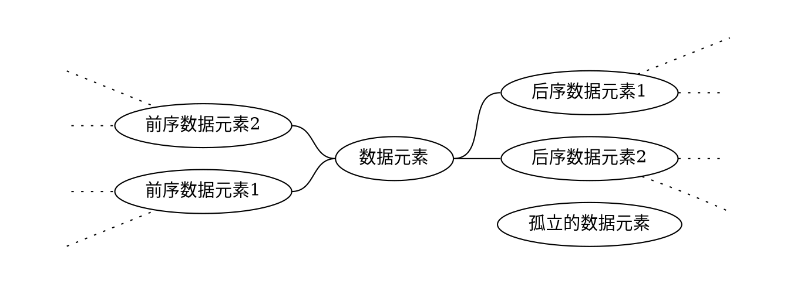
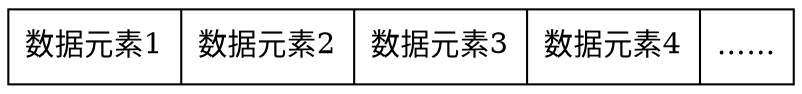
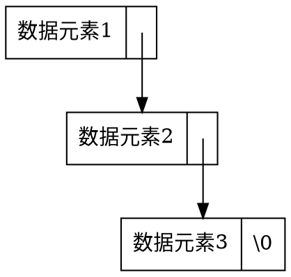
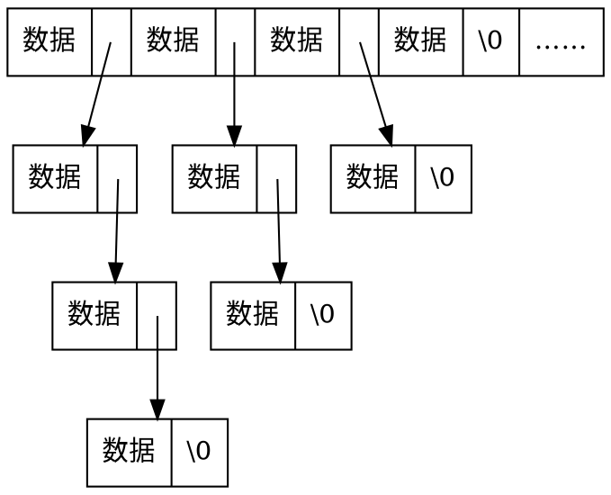
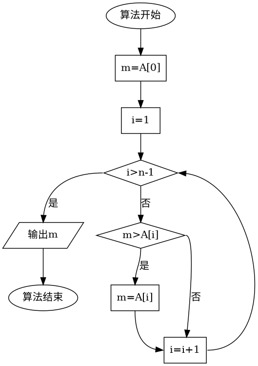

# 0.绪论

[TOC]

## 0.1.数据结构

**数据结构研究数据在计算机中的组织、管理及存储方式，使得各数据能够被高效地访问。**
一个数据结构包含：

1. 一组数据元素的集合；
1. 这些数据元素之间的关系；
1. 以及能够对这些数据元素进行的操作的集合。

不同的数据使用场景会需要不同的数据结构，以获得最优的程序运行效率。对于使用大量数据元素的程序，设计良好的数据结构能够极大地提升程序运行效率，从而节约硬件及时间成本。

数据结构技术可用于操作存储于内存或外存中的数据。本门课主要研究内存中的数据结构技术。

### 0.1.1.数据逻辑结构

数据逻辑结构指各数据元素之间的逻辑关系（离散数学课程的主要内容）。存在以下两种数据逻辑结构大类：

#### 线性结构

每个数据元素最多有一个前驱元素和一个后继元素。


线性数据结构包括：

1. 顺序表
1. 链表
1. 队列
1. 栈

#### 非线性结构

每个数据元素可能有多个前驱元素和多个后继元素。非线性结构中也可以允许数据元素完全没有前驱和后继元素。



非线性数据结构包括：

1. 二叉树
1. 堆
1. 树
1. 图
1. 散列表
1. ……

### 0.1.2.数据物理结构

数据物理结构为数据元素在计算机中实际的存储管理方式（本门课程的主要内容）。**需要注意的是，数据的物理结构可能与其逻辑结构不一致**，逻辑上相邻的数据元素可能并不在相邻的内存空间上。

#### 顺序存储结构

集合中所有数据元素存储在一片连续的存储空间中，使用相对地址来确定各元素之间的关系。



典型的顺序存储结构：

1. 数组与顺序表
1. 二叉树的顺序存储
1. 大根堆与小根堆
1. 图的邻接矩阵

通常，顺序存储结构在设计实现上相对简单，访问速度快 （有例外情况）。但在元素个数不确定且经常变动的情况下，极容易造成存储空间浪费的情况。

#### 链式存储结构

集合中的数据元素可能存储于分散的存储空间中，使用指针或引用来确定各元素之间的关系。




典型的链式存储结构：

1. 各种链表
1. 二叉树的链式存储
1. 树的某些存储方式

通常，链式存储结构设计实现上相对困难，访问速度可能由于需要多次使用指针跳转而相对较慢（有例外情况）。链式存储结构通常十分节约存储资源。

#### 其他复杂存储结构

除了单纯的顺序存储结构和链式存储结构，某些数据结构可能同时使用这两种方式的组合来存储数据元素。




例如：

1. B树
1. 图的邻接表
1. 散列表

> 在后续的示意图中，我们默认使用椭圆形描述数据逻辑结构，使用矩形描述数据物理结构。

### 0.1.3.数据结构在程序设计语言中的支持

低级语言（汇编语言）通常没有内置的数据结构支持。绝大部分高级语言都提供了部分常用数据结构支持，同时允许程序员自行设计数据结构。

C语言提供的原生数据结构支持十分简陋。除开数组以外，几乎所有数据结构都需要C程序员自行编码实现。C++语言的标准模板库（STL）实现了大部分常用的数据结构容器，可以在实践中直接使用。其他高级语言与C++类似，通过库的方式提供了常用的数据结构容器。

**虽然绝大部分程序设计语言都提供了基础的数据结构容器，但是学习各种数据结构的内部原理仍然是十分必要的。** 理解并自行实现各数据结构能够帮助程序员理解各类数据结构的优缺点及适用场景，从而在实践中选择正确的数据结构以满足项目要求。同时，由程序设计语言提供的原生数据结构容器并不能完全覆盖所有使用需求，在程序足够复杂时，仍然需要自行设计数据结构以获得更优的运行效率。

## 0.2.算法

**算法是一组严格指令的有限序列，此指令序列描述用于解决某个特定问题的方法。**
算法有以下三个特征：

1. 指令严格明确，能够用计算机编程实现；
1. 相同的输入对应相同的输出；
1. 能够在有限步内结束。

### 0.2.1.算法的描述方式

以**寻找数组中最小值**为例，可以使用以下几种方式进行算法描述。

#### 自然语言

1. 令当前已知最小值为数组的第一个元素。
1. 依次比较当前已知最小值与数组中的每一个元素，若数组元素比当前已知最小值更小，则更新当前已知最小值为此元素的值。
1. 当遍历完所有数组元素后，当前已知最小值就是数组中元素的最小值。

优点：描述简单，容易读懂。
缺点：容易出现歧义，复杂算法较难通过自然语言描述。

#### 程序设计语言源码

对于逻辑相对简单的算法，可以直接使用某程序设计语言的源代码进行描述。（本课程使用的方式）

```c++{class="line-numbers"}
//C++语言描述的寻找最小值算法
int min(int arr[], int n){
    int min_value = arr[0];
    for(int i=1; i<n; ++i){
        if(min_value > arr[i]){
            min_value = arr[i];
        }
    }
    return min_value;
}
```

优点：描述准确，能够直接编译运行查看效果。
缺点：不同程序语言的描述可能差异巨大，需要学习相应的程序设计语言，过多语言细节可能影响程序逻辑的理解。

#### 伪代码

对于逻辑相对复杂的算法，通常使用伪代码进行描述。（本课程使用的方式）

>* **输入**: 数组$A$
>* **输出**: 最小值$m$
>
>1. **Procedure** min ($A$)
>1. &emsp;$m \gets A[0]$
>1. &emsp;**For** $n \in A$
>1. &emsp;&emsp;**If** $m > n$ **Then**
>1. &emsp;&emsp;&emsp; $ m\gets n$
>1. &emsp;&emsp;**End If**
>1. &emsp;**End For**
>1. &emsp;**Return** $m$
>1. **End Procedure**

优点：描述准确，可以使用数学语言，能够专注于算法逻辑而不受程序语言细节影响。
缺点：不能直接编译运行。

#### 流程图



优点：描述准确，能够直观看到逻辑流程。
缺点：绘作相对复杂，难以处理复杂逻辑，不能直接编译运行。

### 0.2.2.算法时间复杂度分析

算法的**时间复杂度**（或计算复杂度）用于描述该算法完成相应操作的时间，从而评价此算法的运行效率。

#### 时间复杂度的度量

由于即使是同样的算法和同样的输入数据，在不同配置的计算机上所运行的时间也是不同的。所以，直接测量执行一次算法的时间无法准确反映算法的优劣。

较为客观的方法是统计在执行一次算法时所需要的**基本运算次数**。基本运算指一条计算机指令或若干条指令可以完成的操作，例如加、减、乘、除运算、赋值、比较，等。以寻找线性搜索算法为例：

```c++{class="line-numbers"}
//C++语言描述的线性搜索算法
//返回arr数组中值为key的元素的下标，若key不在数组中返回-1
int linear_search(int arr[], int n, int key){

    //若完整执行for循环，包含以下操作：
    //1次赋值操作（i=0），n次比较操作（i<n），n次相加、赋值操作（++i）
    //循环体内部操作执行n次
    for(int i=0; i<n; ++i){
        if(arr[i] == key){  //1次比较操作
            return i;       //1次返回操作
        }
    }
    return -1;              //1次返回操作
}
```

经过分析后，可以发现这个算法执行所需要的操作数目即使在$n$确定的情况下，也是不确定的。循环体内部语句的执行次数将由第9行中表达式arr[i] == key的值确定。在实践中，我们常需要估计在遇到最有利的一组数据、最不利的一组数据以及平均情况下算法运行所需要的时间。

在本例中，最有利的情况为arr[0]存储了待查找的元素，则循环体仅进行了一次迭代，程序在第一次执行到第10行时退出。将最有利情况下所有操作数进行统计：

$$
\begin{align*}
 1 & &+ 1 & & + 1 & & + 1 &= 4\\
 \text{(int i=0)}& & \text{(i<n)} & & \text{(arr[i] == key)} & & \text{(return i)}\\
\end{align*}
$$

最不利的情况为待查元素不存在于数组arr中，则循环体将执行$n$次，同时第10行的语句不被执行，算法在第13行退出。将最不利情况下所有操作数进行统计：

$$
\begin{align*}
 1 & & + n & & + 2n & & + n & & + 1 &= 4n+2\\
 \text{(int i=0)} & & n\text{次(i<n)} & & n\text{次(++i)} & & n\text{次(arr[i] == key)} & & \text{(return -1)}\\
\end{align*}
$$

算法平均情况下的操作次数于各中国年情况的分布有关。当key值在数组中处于$j$位置时，算法循环体将执行$j$次，并在第10行退出。次情况下的操作数统计为：

$$
\begin{align*}
 1 & & + j & & + 2j & & + j & & + 1 &= 4j+2\\
 \text{(int i=0)} & & j\text{次(i<n)} & & j\text{次(++i)} & & j\text{次(arr[i] == key)} & & \text{(return i)}\\
\end{align*}
$$

假设key总是存在于arr数组中，且其处于任意位置的概率都是$1/n$，那么平均情况的复杂度为:
$$
\frac{1}{n}\sum_{j=1}^{n}(4j+2) = 2n+3
$$

在算法设计中需要着重考虑最坏情况的复杂度，防止程序运算时间过长造成系统失败。平均复杂度帮助我们了解长时间重复使用一个算法可能出现的效率。最好情况复杂度相对其他两个来说重要性较低。

#### 时间复杂度的比较

算法复杂度的优劣取决于在输入数据规模$n$增长时其增长速度的快慢。简单的说，若算法耗时的增长受输入数据规模$n$增长的影响越小，算法越优秀。下表展示了一些常见表达式的值随自变量增长的情况：

表达式| $n=10$ | $n=100$ | $n=1000$
---|---|---|---
$\log_2 n$ | $\approx 3$ |  $\approx 7$ | $\approx 10 $
$n$ | $10$ | $100$ | $1000$
$n^2$ | $100$ | $10000$ | $10^6$
$n^3$ | $1000$ | $10^6$ | $10^9$
$2^n$ | $1024$ | $\approx 1.27 \times 10^{30}$ | $\approx 1.07 \times 10^{301}$
$n!$ | $\approx 3.6 \times 10^6$ | $\approx 9.3 \times 10^{157}$ | $\approx 4.0 \times 10^{2568}$

通常算法复杂度都表现为一个含数据规模$n$的表达式，直接比较并不方便，例如 $3n^2 + 2n$ 和 $n^3 + 4$。
我们通常比较表达式的阶。
引入$O$记号：

**定义**：设$f(n)$与$g(n)$是定义域为自然数值域为正实数的函数。如果存在一个常数$c>0$和某个自然数$n_0$,使得对于任意$n>n_0$，关系$f(n)\leq c \cdot g(n)$都成立，则$f(n)$的阶不高于$g(n)$，记作$f(n)=O(g(n))$。

>思考：为什么只关心 $n>n_0$ 的情况？

@import "图/big0.png" {width=60%}

常见的复杂度阶有如下几种

复杂度|说明 | 举例
---|---|---
$O(1)$ | 常数时间复杂度，算法操作时间与输入数据规模无关。|获取数组中第$i$个元素
$O(\log n)$ |对数时间复杂度，算法操作时间随输入数据规模增长而增长，但增幅较缓慢。| 使用二分法查找有序数组中的元素
$O(n)$ | 线性时间复杂度，算法操作时间的增长基本与数据规模增长幅度相同。| 寻找数组中最大值
$O(n \log n)$ | 线性对数时间复杂度，法操作时间的增长比数据规模增长幅度稍大。 | 快速排序、归并排序
$O(n^k)$ | 多项式时间复杂度（$k$为常数），算法操作时间随数据规模的增长而有较大幅度的增长。| 冒泡排序算法$O(n^2)$
$O(k^n)$ | 指数级时间复杂度（$k$为常数），算法操作时间随数据规模的增长而急剧增长。| 象棋AI算法
$O(n!)$ | 阶成级时间复杂度，通常认为此时间复杂度的算法在中等级以规模的数据不具有操作性。| 旅行商问题的暴力求解算法

复杂度阶的比较遵循以下规则：
$$O(1) < O(\log n) < O(n) < O(n\log n) < O(n^k) < O(k^n) < O(n!)$$

若两个算法的时间复杂度都可记作同样的$O(g(n))$，我们认为这两个算法的效率相当。

>注意：复杂度阶表达式中对数的底数默不写。若两个时间复杂度表达式为 $\log_k n$ 和 $\log_s n$（$k$和$s$为常数），我们认为它们同属$O(\log n)$

对于 $3n^2 + 2n$ 和 $n^3 + 4n$ 这两个表达式，根据上述定义可以知道，$3n^2 + 2n = O(n^2)$ 而 $n^3 + 4 = O(n^3)$。所以 $3n^2 + 2n$ 的阶更低。**通常我们希望算法时间复杂度的阶越低越好。**

线性搜索算法的平均时间复杂度$2n+3$可记作$O(n)$，最坏情况复杂度$4n+2$可记作$O(n)$，最好情况复杂度$4$可记作$O(1)$。

>注意，两个时间复杂度等阶的算法的实际运行效率不一定相等，但时间复杂度阶低的算法一定比阶高的算法效率更高。

除了$O$记号，阶的比较符号还有$\Omega$和$\Theta$。
$O$描述上界阶，$\Omega$描述下界阶，$\Theta$描述确界阶。
具体内容将在《算法设计》课程中讲述，本课程只关心并使用$O$记号。

## 0.3.数据结构与算法的关系

绝大部分情况下，数据结构与算法关系密切。数据结构描述数据的存储方式，算法描述数据的操作方式。数据结构通常直接影响算法的实现细节与效率。

很多算法在相应的数据结构上才能产生良好的性能。例如，二分查找算法只能在有序的顺序存储数据结构上获得$O(\log n)$的时间复杂度；二叉搜索树的更新算法只能在链式存储的二叉树结构中获得$O(1)$的时间复杂度。
