# 1.线性结构

[TOC]

线性结构是最为简单也是最常用的一类数据逻辑结构。线性结构数据集中除了头元素和尾元素，其他所有元素都有且只有一个前序元素和一个后继元素，头元素没有前序元素，尾元素没有后继元素。即在线性结构中，各个数据元素有明确的前后关系，且每个元素最多与另外两个元素相邻。

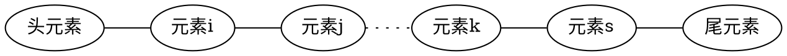

线性结构是最为基础的一类数据结构，在数据存储和算法中具有非常广泛的运用。目前绝大部分高级程序语言都对线性结构给予了直接的内置支持。本章介绍各线性结构的基本思想及实现方法，在实践中应尽量使用程序语言标准库中的线性结构容器。

## 1.1.顺序表

顺序表是最基础的一种数据结构。通常，如果数据集没有特殊的要求，都会使用顺序表进行存储操作。

顺序表使用一片连续内存空间存储，数据集中的元素按照逻辑关系依次紧密地排列在内存空间中。顺序表支持以下操作：

1. 获取当前数据集中元素个数；
1. 通过元素的逻辑位置读取其值（读取数据集中的第k个元素）；
1. 更改任意位置的元素值（更改数据集中的第k个元素）；
1. 向任意逻辑位置插入新的元素（向数据集中的第k个位置插入新元素）；
1. 删除任意逻辑位置的元素（删除数据集中的第k个元素）。

顺序表一般使用数组作为内部存储结构，同时增加另外两个整形变量分别记录当前数据集中元素的个数与最大容量。

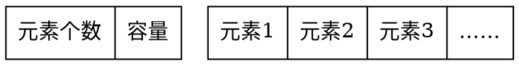

### 1.1.1.顺序表的实现原理

C++在标准容器库中提供了顺序表类std::vector。以下我们介绍std::vector的基本内部实现原理。为以示区别，本例中我们以simVector为类名，其声明如下：

```c++{class="line-numbers"}
template <class T>
class simVector{
private:
    int m_size;     //标记当前数据元素个数
    int m_capacity; //标记当前容器容量
    T *m_data;      //用于存储数据元素的数组
    
public:
    simVector(int n=4);
    ~simVector();
    
    int size();                 //获取当前元素个数
    int capacity();             //获取当前容器容量
    T& operator[](int id);           //获取位于id位置的元素
    void reserve(int newCapacity);   //扩容
    void insert(int index, T data);  //在index位置插入data
    void erase(int index);           //删除index位置的元素
    void push_back(T data);          //在表尾插入数据
};
```

simVector类的成员变量 T *m_data 数组指针指向实际存储数据的数组。由于在C++语言中，数组声明之后的长度是固定的，而在实际使用中，我们并不总能确定数据集中元素的个数，同时我们希望数据集能够随时增减数据元素。所以simVector中有另外两个整型成员变量：m_size 标记当前数据集中数据元素的个数即 m_data 数组中存储元素的个数；以及 m_capacity 标记当前容器容量即 m_data 数组的长度。

simVector并不一定使用全部的 m_data 数组空间。如果当前元素个数小于容器容量，所有元素将存储于  m_data 数组中靠前的内存中。

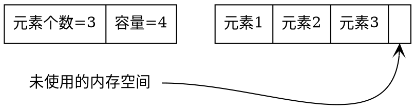

>**注意：** 由于考虑到通用性及效率，STL中vector的实现方式比此例复杂很多。为了不过多引入语言细节干扰，我们在此仅展示vector的基础思想。

#### 构造与析构函数 {ignore=true}

simVector的构造函数初始化当前容器元素个数为0，容量为参数 n，同时申请一个长度为 n 的 T 类型数组，并将数组地址保存于指针 m_data。

simVector的析构函数释放 m_data 所指向的内存空间。

```c++{class="line-numbers"}
template <class T>
simVector<T>::simVector(int n) {
    m_size = 0;
    m_capacity = n;
    m_data = new T[m_capacity];
}

template <class T>
simVector<T>::~simVector() {
    delete[] m_data;
}
```

#### 获取元素个数及容器容量 {ignore=true}

m_size 记录了当前容器中的元素个数。m_capacity 记录了当前容器的容量。

```c++{class="line-numbers"}
template <class T>
int simVector<T>::size(){
    return m_size;
}

template <class T>
int simVector<T>::capacity(){
    return m_capacity;
}
```

#### 读取或更改某位置元素 {ignore=true}

在顺序表中，元素依次紧密排列在内存中，且各元素所占内存大小相同，因此可以通过元素位置直接计算得到其物理地址。通过重载 [] 符号，可以使我们能够像使用数组一样直接访问 simVector 中的某个元素。

```c++{class="line-numbers"}
template<class T>
T& simVector<T>::operator[](int id){
    return m_data[id];
}
```

注意，此函数返回值类型是一个引用变量。这样做能够直接改变数据集中的元素。

>顺序表访问或更改某元素的时间复杂度为$O(1)$。

#### 向某位置插入元素 {ignore=true}

向某位置插入元素时，需要将此位置及之后的所有元素向后挪动一个内存单位（元素所占用内存大小），然后将待插入元素插入空出的内存位置。

举例
将*待插入元素*插入*元素2*所在位置：

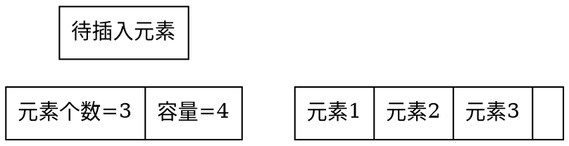

**第1步**，将顺序表元素个数变量值加1。


**第2步**，依次将*元素3*、*元素2*后移覆盖其后序元素：

将*元素3*向后一位复制

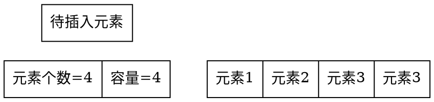

将*元素2*向后一位复制


**第3步**，将待插入元素覆盖原先*元素2*的位置：

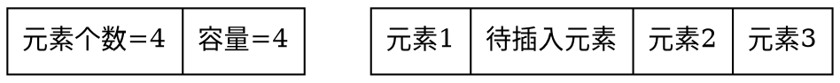

如果当前元素个数已经达到容器容量，那么需要对 m_data 数组进行扩容。由于C++并不支持改变数组的长度，我们需要使用一个技巧来达到这个目的。方法就是重新申请一段更大的内存空间，然后将原 m_data 中的数据拷贝到新的内存空间，再将 m_data 所指向的空间释放，同时将 m_data 指向新申请的内存空间，最后标记容器容量为新内存空间的长度。

```c++{class="line-numbers"}
template <class T>
void simVector<T>::reserve(int newCapacity) {
    T* old = m_data;
    m_data = new T[newCapacity];
    for (int i=0; i<m_size; ++i) {
        m_data[i] = old[i];
    }
    m_capacity = newCapacity;
    delete [] old;
}

template <class T>
void simVector<T>::insert(int index, T data) {
    if(m_size == m_capacity){
        reserve(m_capacity*2);
    }
    m_size++;
    for(int i=m_size-1; i> index; i--){
        m_data[i] = m_data[i-1];
    }
    m_data[index] = data;
}
```

insert(int index, T data) 函数在 index 位置插入元素 data。该函数首先确认当前容器是否有剩余空间，若有，则将从 index 位开始之后的每一个元素拷贝至其后一位（注意，这里需要从数组尾部开始向前操作）；若空间不足，则使用 reserve 函数对容器空间进行扩容后再进行插入操作。

>顺序表插入元素的平均时间复杂度为$O(n)$。
 **注意：** 当容器中元素数量较多并触发扩容时，将产生大量的拷贝操作，可能对程序性能造成影响。在实践中应尽可能预估数据集的规模，并在一开始就申请足够的空间，尽量减少扩容的触发。
 C++标准容器库std::vector类的插入函数使用方式与此例稍有不同。std::vector 的 insert 函数的第一个参数为迭代器。本例为了简单起见，使用了元素下标位置。

#### 向表尾部插入元素 {ignore=true}

在顺序表插入元素的操作中，最常见的是向表尾部插入新元素。虽然 insert 函数已经能够完成此功能，但使用时需要手动指明插入位置。而顺序表尾部的位置一定等于数据元素的个数。所以，可以使用如下的 push_back 函数实现更为方便的尾部插入操作。

```c++{class="line-numbers"}
template<class T>
void simVector<T>::push_back(T data){
    insert(m_size, data);
}
```

#### 删除某位置元素 {ignore=true}

删除顺序表中某位置的元素的方法为：依次将该位置后面的的所有元素覆盖其前序元素。

```c++{class="line-numbers"}
template <class T>
void simVector<T>::erase(int index){
    for(int i=index; i<m_size-1; ++i){
        m_data[i] = m_data[i+1];
    }
    m_size--;
}
```

举例
删除*待删除元素*：

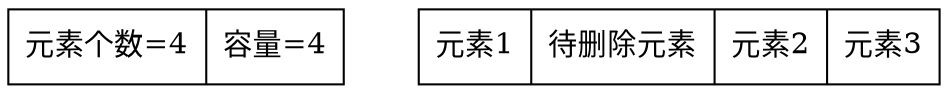

**第1步**，依次将*元素2*、*元素3*前移覆盖其前序：

将*元素2*向前复制


将*元素3*向前复制

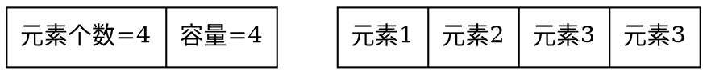

**第2步**，将顺序表元素个数变量值减1。

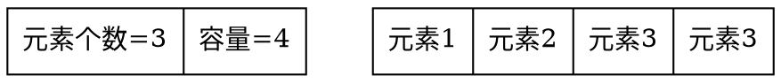

>**注意：** 这里我们并不对原来*元素3*位置上的数据进行更多的操作。（为什么？）
顺序表删除元素的平均时间复杂度为$O(n)$。

### 1.1.2. simVector的完整代码

```c++{class="line-numbers"}
#ifndef simVector_h
#define simVector_h

template <class T>
class simVector{
private:
    int m_size;     //标记当前数据元素个数
    int m_capacity; //标记当前容器容量
    T *m_data;      //用于存储数据元素的数组
    
public:
    simVector(int n=4);
    ~simVector();
    
    int size();                 //获取当前元素个数
    int capacity();             //获取当前容器容量
    T& operator[](int id);           //获取位于id位置的元素
    void reserve(int newCapacity);   //扩容
    void insert(int index, T data);  //在index位置插入data
    void erase(int index);           //删除index位置的元素
    void push_back(T data);          //在表尾插入数据
};

template<class T>
void simVector<T>::push_back(T data){
    insert(m_size, data);
}

template <class T>
simVector<T>::simVector(int n) {
    m_size = 0;
    m_capacity = n;
    m_data = new T[m_capacity];
}

template <class T>
simVector<T>::~simVector() {
    delete[] m_data;
}

template<class T>
T& simVector<T>::operator[](int id){
    return m_data[id];
}

template <class T>
int simVector<T>::size(){
    return m_size;
}

template <class T>
int simVector<T>::capacity(){
    return m_capacity;
}

template <class T>
void simVector<T>::reserve(int newCapacity) {
    T* old = m_data;
    m_data = new T[newCapacity];
    for (int i=0; i<m_size; ++i) {
        m_data[i] = old[i];
    }
    m_capacity = newCapacity;
    delete [] old;
}

template <class T>
void simVector<T>::insert(int index, T data) {
    if(m_size == m_capacity){
        reserve(m_capacity*2);
    }
    m_size++;
    for(int i=m_size-1; i> index; i--){
        m_data[i] = m_data[i-1];
    }
    m_data[index] = data;
}

template <class T>
void simVector<T>::erase(int index){
    for(int i=index; i<m_size-1; ++i){
        m_data[i] = m_data[i+1];
    }
    m_size--;
}

#endif /* simVector_h */
```


以下代码示例了simVector的使用方法。

```c++{class="line-numbers"}
#include <iostream>
#include "simVector.h"
using namespace std;

void main(){
    simVector<int> a;
    a.push_back(1);
    a.push_back(2);
    a.push_back(3);
    a.erase(1);
    a.insert(1, 4);
    a[0] = 5;
    
    for(int i=0; i<a.size(); ++i){
        cout<<a[i]<<" ";
    }
}
```

代码的输出为

>5 4 3

关于STL的std::vector使用方法，参见：
https://cplusplus.com/reference/vector/vector/

## 1.2.链表

与顺序表不同，链表的元素可能并不存在于一片连续的内存空间。逻辑相邻的元素可能物理上并不相邻，同时物理上相邻的元素可能逻辑并不相邻。

链表结构使用链表节点存储数据元素。通常一个节点存储一个数据元素，并使用节点指针维护元素之前的前后关系。在实践中，使用一个指向某节点的节点指针对链表进行操作。
链表支持以下操作：

1. 获得第一个元素节点的指针；
1. 获得某元素节点的前序或者后继节点的指针；
1. 更改当前指针所指向节点的元素；
1. 在指针所在位置插入元素；
1. 在指针所在位置删除元素。

### 1.2.1.单链表

单链表的节点结构如下，存储一个数据元素（T data），和一个指向此类结构体的指针（link_node* next）。

```c++{class="line-numbers"}
template<class T>
struct link_node{
    T data;
    link_node* next;
    link_node(T d, link_node* n):data(d), next(n){}
};
```

根据是否有头节点，单链表有两种形式

#### 不带头节点的单链表 {ignore=true}

不带头节点的单链表的每一个节点都存储一个数据元素，next指针指向该元素后继元素的结构体，最后一个节点的next指针为空。

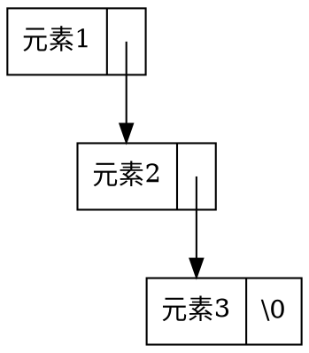

#### 带头节点的单链表 {ignore=true}

带头节点的单链表含有一个不存储任何数据的头节点。除头结点外，带头节点的单链表的每一个节点都存储一个数据元素，next 指针指向该元素后继元素的结构体，最后一个节点的 next 指针为空。头节点的数据域 data 不存储任何有意义的信息。

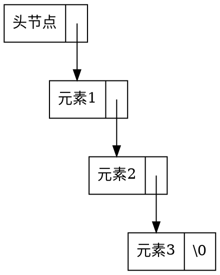

在实践中，带头节点的单链表使用得更多一些。因为，如果没有头节点，那么对链表第一个元素进行操作的代码将与其他元素不同，造成编码相对困难。而带头节点的链表可以使用同一套代码操作所有元素。以下代码都以带头节点的链表为例。

#### 单链表元素遍历访问 {ignore=true}

由于链表的元素可能散落在内存的各个位置，需要使用指针从头节点开始根据next指针依次定位各个元素。不能像顺序表那样直接得到第$k$个元素的地址。

以下代码展示了已知头节点指针，如何依次打印所有单链表中数据元素的方法。

```c++{class="line-numbers"}
//从第一个元素开始，依次打印链表中所有元素
template<class T>
void print_list(link_node<T>* const head){
    auto curr_node = head->next;
    while(curr_node != nullptr){
        cout<<curr_node->data<<" ";
        curr_node = curr_node->next;
    }
}
```

#### 单链表添加元素 {ignore=true}

与顺序表不同，链表在添加元素时不需要对其他元素进行移动，只需要更改添加位置相关元素节点的 next 指针。以下代码展示如何在 node 节点之后添加 data 元素。

```c++{class="line-numbers"}
//在node后插入数据元素data，并返回新元素节点的指针
template<class T>
link_node<T>* insert_after(link_node<T>* node, T data){
    auto new_node = new link_node<T>(data, nullptr);
    new_node->next = node->next;
    node->next = new_node;
    return new_node;
}
```

举例：
在*元素1*之后添加元素

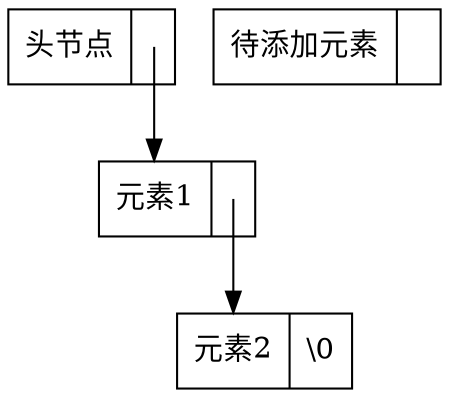

**第1步**，将待*添加元素*的 next 指针指向*元素2*。

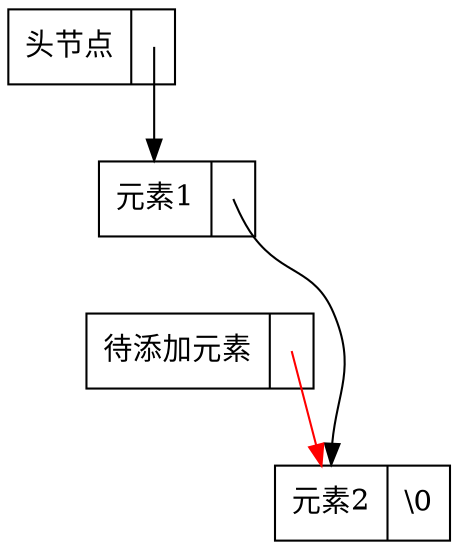

**第2步**，将*元素1*的next指针指向待*添加元素*。

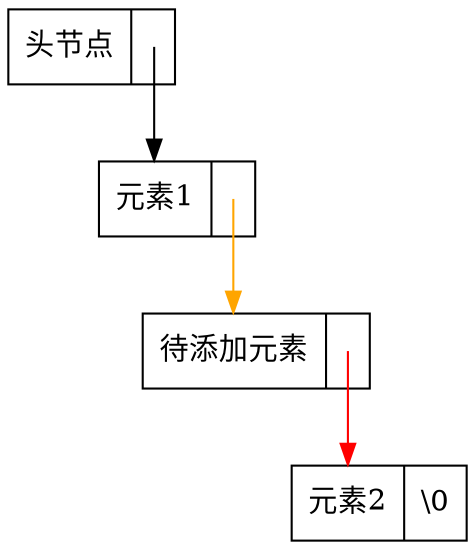

>**注意：** 第1步和第2步的顺序是不能调换的
>单链表添加元素的时间复杂度为$O(1)$。

#### 单链表删除元素 {ignore=true}

与添加元素相同，单链表在删除元素的时候同样不需要移动其他元素，只需要更改相应元素节点的 next 指针。

```c++{class="line-numbers"}
//删除node节点后的元素
template<class T>
void delete_after(link_node<T>* const node){
    if(node->next != nullptr){
        auto deleted_node = node->next;
        node->next = node->next->next;
        delete deleted_node;
    }
}
```

>**注意：** 由于单链表的性质，不能删除给定指针的节点。（思考：为什么？）
在删除链表节点时，一定要释放节点内存，以免造成内存泄露。
单链表删除元素的时间复杂度为$O(1)$。

举例
删除*元素1*后的元素

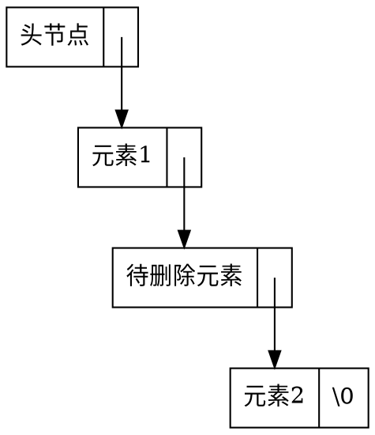

**第1步**，将待删除元素的前序元素（*元素1*）的next指针指向待删除元素的后继元素（*元素2*）。

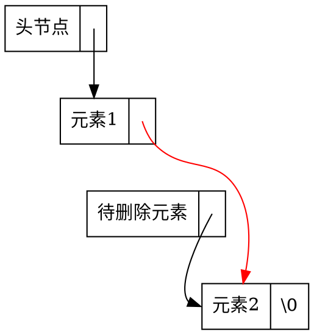

**第2步**，释放*待删除元素*所占用的内存

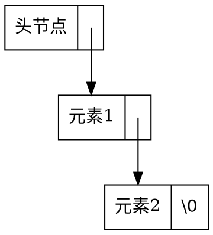

#### 测试单链表 {ignore=true}

以下代码演示了向空单链表中依次向头节点后插入1、2、3；记录节点元素2的指针；删除节点元素2的后继元素。

```c++{class="line-numbers"}
int main(){
    auto head = new link_node<int>(0, nullptr);
    insert_after(head, 1);
    auto p = insert_after(head, 2);
    insert_after(head, 3);
    
    delete_after(p);
    print_list(head);
}
```

代码的输出为:

> 3 2

### 1.2.2.双链表

单链表在操作时，只能从头节点方向开始依次向后进行。而实践中，有时会希望反向或双向进行。在这种需求下，可以使用双链表。

与单链表相同，为了方便操作，双链表也通常设置头节点。同时为了方便从后往前操作，双链表通常还设置有一个尾节点。头节点和尾节点中的数据域都不实际存储数据。

```dot
digraph G{
    node [shape = record]
    H [label = "<p> \\0|<data> 头节点|<n> "]
    A [label = "<p> |<data> 元素1|<n> "]
    B [label = "<p> |<data> 元素2|<n> "]
    C [label = "<p> |<data> 元素3|<n> "]
    T [label = "<p> |<data> 尾节点|<n> \\0"]
    A:n:c -> B:data [tailclip=false]
    B:p:c -> A:data [tailclip=false]
    B:n:c -> C:data [tailclip=false]
    C:p:c -> B:data [tailclip=false]
    H:n:c -> A:data [tailclip=false]
    A:p:c -> H:data [tailclip=false]
    C:n:c -> T:data [tailclip=false]
    T:p:c -> C:data [tailclip=false]
}
```

C++标准模板库中同样也给出了通用的双链表实现 std::list。我们接下来讲解 std::list 的基本思想与实现方法。为以示区别，本例以 simList 为类名。

simList 对双链表的结构与操作进行了封装，使用时用户程序员不需要考虑同时也无法接触的双链表的内部指针结构。使用更加方便安全。

```c++{class="line-numbers"}
template <class T>
class simList {
private:
    
    //双链表节点
    struct node{
        T data;
        node *prev, *next;
        node(T d, node *p, node *n):data(d), prev(p), next(n){};
    };
    
    int m_size;
    node *m_head;
    node *m_tail;
    
public:
    
    //双链表迭代器
    class iterator{
        friend class simList<T>;
    private:
        node *m_current;
        iterator(node *p):m_current(p){};
    public:
        T& get_data();    //获取当前迭代器所指节点中的元素
        iterator next();  //获取当前迭代器所指节点的后继节点迭代器
        iterator prev();  //获取当前迭代器所指节点的前序节点迭代器
        bool operator!=(iterator itr);
    };
    
    simList();
    ~simList();
    iterator begin();                       //获取第一个元素的迭代器
    iterator end();                         //获取尾节点迭代器
    iterator insert(iterator itr, T item);  //在迭代器itr位置之前插入item
    iterator erase(iterator itr);           //删除迭代器指向的节点
    int size(){return m_size;}              //获取元素个数
    void push_back(const T item);           //在List尾部添加数据元素item
};
```

simList 是一个复合封装结构类。有两个内部类： node 结构体为链表节点类，用于存储数据元素；iterator 类为迭代器，用于对数据元素的操作。

simList 本身只有三个成员变量：m_size 记录当前表中元素个数；m_head 为头节点指针；m_tail 为尾节点指针。

>**注意：** 由于考虑到通用性及效率，STL中list的实现方式比此例复杂很多。为了不过多引入语言细节干扰，我们在此仅展示list的基础思想。

#### node链表节点 {ignore=true}

node 类与前面单链表节点类基本相同，多了一个 prev 指针，指向前序节点。

```c++{class="line-numbers"}
    struct node{
        T data;
        node *prev, *next;
        node(T d, node *p, node *n):data(d), prev(p), next(n){};
    };
```

#### iterator迭代器 {ignore=true}

由于双链表结构较为复杂，在进行元素变更操作时，有可能由于用户程序员的失误造成结构波坏，链表断裂。因此，simList 使用迭代器来对链表进行操作。

迭代器类封装了部分对节点的操作，以免将双链表内部指针结构暴露给用户程序员，防止用户程序员在使用时不小心破坏双链表结构。迭代器提供以下操作：

1. 获得当前节点的数据元素；
1. 获得当前节点前序节点的迭代器；
1. 获得当前节点后继节点的迭代器；
1. 判断两个迭代器是否指向同一个节点。

```c++{class="line-numbers"}
    class iterator{
        friend class simList<T>;
    private:
        node *m_current;
        iterator(node *p):m_current(p){};
    public:
        T& get_data();    //获取当前迭代器所指节点中的元素
        iterator next();  //获取当前迭代器所指节点的后继节点迭代器
        iterator prev();  //获取当前迭代器所指节点的前序节点迭代器
        
        bool operator!=(iterator itr);
    };
```

iterator 类只有一个成员变量 m_current 节点指针，指向此迭代器当前操作的节点。

##### 获取迭代器所指元素 {ignore=true}

```c++{class="line-numbers"}
template <class T>
T& simList<T>::iterator::get_data() {
    return m_current->data;
}
```

注意这里返回的是一个引用变量，这样在更改返回的元素时，链表中的元素能够同步进行更改。

##### 获得后继节点迭代器 {ignore=true}

```c++{class="line-numbers"}
template <class T>
typename simList<T>::iterator simList<T>::iterator::next() {
    return simList<T>::iterator(m_current->next);
}
```

这里的实际操作为，新建了一个指向后继节点的迭代器类。注意由于 simList\<T\>::iterator 是一个*依赖标识符*，所以在其前面需要加 typename 关键字。

##### 获得前序节点迭代器 {ignore=true}

```c++{class="line-numbers"}
template <class T>
typename simList<T>::iterator simList<T>::iterator::prev() {
    return simList<T>::iterator(m_current->prev);
}
```

与 next() 函数实现逻辑相同，这里实际上是新建了一个指向前序节点的迭代器。

##### 迭代器不等判定 {ignore=true}

```c++{class="line-numbers"}
template <class T>
bool simList<T>::iterator::operator!=(iterator itr) {
    return m_current != itr.m_current;
}
```

这里重载 != 符号，用于判定两个迭代器是否指向不同的节点。

#### 构造函数 {ignore=true}

```c++{class="line-numbers"}
template <class T>
simList<T>::simList() {
    m_size = 0;
    m_head = new node(T(), nullptr, nullptr);
    m_tail = new node(T(), nullptr, nullptr);
    m_head->next = m_tail;
    m_tail->prev = m_head;
}
```

simList 的构造函数初始化元素个数为0，同时分别创建头节点和尾节点，并将它们按照如下方式连接起来。

```dot
digraph G{

    node [shape = record]
    H [label = "<p> \\0|<data> 头节点|<n> "]
    A [label = "<p> |<data> 尾节点|<n> \\0"]
    
    
    H:n:c -> A:data [tailclip=false]
    A:p:c -> H:data [tailclip=false]
}
```

#### 析构函数 {ignore=true}

```c++{class="line-numbers"}
template <class T>
simList<T>::~simList(){
    while(m_size > 0){    //依次删除第一个元素
        erase(begin());
    }
    delete m_head;
    delete m_tail;
}
```

simList 的析构函数依次删除表中的第一个元素（begin()函数返回第一个元素的迭代器），直到表为空。然后释放头节点和尾节点占用的内存空间。

#### 获取第一个元素 {ignore=true}

```c++{class="line-numbers"}
template <class T>
typename simList<T>::iterator simList<T>::begin() {
    return simList<T>::iterator(m_head->next);
}
```

新建并返回一个指向头节点后续节点的迭代器。如果表中元素为空，此函数将返回一个指向尾节点的迭代器。

#### 获取尾节点迭代器 {ignore=true}

```c++{class="line-numbers"}
template <class T>
typename simList<T>::iterator simList<T>::end() {
    return simList<T>::iterator(m_tail);
}
```

新建并返回一个指向尾节点后续节点的迭代器。尾节点迭代器常用于在链表遍历的场景中判断是否已经访问完所有元素节点。

#### 在某迭代器所指节点前插入元素 {ignore=true}

```c++{class="line-numbers"}
template <class T>
typename simList<T>::iterator simList<T>::insert(iterator itr, T item) {
    node *p = itr.m_current;
    node *newNode = new node(item, p->prev, p);
    p->prev->next = newNode;
    p->prev = p->prev->next;
    ++m_size;
    return iterator(p->prev);
}
```

举例：
在*元素2*之前插入元素

```dot
digraph G{

    node [shape = record]
    H [label = "<p> \\0|<data> 头节点|<n> "]
    A [label = "<p> |<data> 元素1|<n> "]
    B [label = "<p> |<data> 待添加元素|<n> "]
    C [label = "<p> |<data> 元素2|<n> "]
    T [label = "<p> |<data> 尾节点|<n> \\0"]
    A:n:c -> C:data [tailclip=false]
    C:p:c -> A:data [tailclip=false]
    H:n:c -> A:data [tailclip=false]
    A:p:c -> H:data [tailclip=false]
    C:n:c -> T:data [tailclip=false]
    T:p:c -> C:data [tailclip=false]
}
```

**第1步**，将*待添加元素*节点的prev指针指向*元素1*，next指针指向*元素2*。

```dot
digraph G{
    node [shape = record]
    H [label = "<p> \\0|<data> 头节点|<n> " 
    group="list"]
    A [label = "<p> |<data> 元素1|<n> " group="list"]
    B [label = "<p> |<data> 待添加元素|<n> "]
    C [label = "<p> |<data> 元素2|<n> "]
    T [label = "<p> |<data> 尾节点|<n> \\0"]
    A:n:c -> C:data:c [tailclip=false ]
    C:p:c -> A:data:c [tailclip=false]
    H:n:c -> A:data [tailclip=false]
    A:p:c -> H:data [tailclip=false]
    B:p:c -> A:data [color=red tailclip=false]
    B:n:c -> C:data [color=red tailclip=false]
    A->B [style=invis]
    C:n:c -> T:data [tailclip=false]
    T:p:c -> C:data [tailclip=false]
}
```

**第2步**，将*元素1*的next指针指向*待添加元素*。将*元素2*的prev指针指向*待添加元素*。

```dot
digraph G{
    node [shape = record]
    H [label = "<p> \\0|<data> 头节点|<n> "]
    A [label = "<p> |<data> 元素1|<n> "]
    B [label = "<p> |<data> 待添加元素|<n> "]
    C [label = "<p> |<data> 元素2|<n> "]
    A:n:c -> B:data [color=orange tailclip=false]
    C:p:c -> B:data [color=orange tailclip=false]
    H:n:c -> A:data [tailclip=false]
    A:p:c -> H:data [tailclip=false]
    B:p:c -> A:data [color=red tailclip=false]
    B:n:c -> C:data [color=red tailclip=false]
    T [label = "<p> |<data> 尾节点|<n> \\0"]
    C:n:c -> T:data [tailclip=false]
    T:p:c -> C:data [tailclip=false]
}
```

> 双链表添加元素的时间复杂度为$O(1)$。

#### 在表尾部插入元素 {ignore=true}

向双链表尾部插入数据是非常常见的操作，可以通过 insert 函数向尾节点前插入元素完成。为了更方便操作，这里对其进行封装。

```c++{class="line-numbers"}
template <class T>
void simList<T>::push_back(const T item){
    insert(end(), item);
}
```

#### 删除迭代器所指元素 {ignore=true}

```c++{class="line-numbers"}
template <class T>
typename simList<T>::iterator simList<T>::erase(simList<T>::iterator itr) {
    node *p = itr.m_current;
    iterator re(p->next);
    p->prev->next = p->next;
    p->next->prev = p->prev;
    delete p;
    m_size--;
    return re;
}
```

erase 函数从表中删除 itr 迭代器所指的节点，并返回 itr 所指节点的后续节点迭代器。

>**注意：** 与单链表相同，双链表在删除元素时要记得释放删除节点的内存空间，以免内存泄露。
删除双链表中元素的时间复杂度为$O(1)$。

举例：
删除*待删除元素*：

```dot
digraph G{
    node [shape = record]
    H [label = "<p> \\0|<data> 头节点|<n> "]
    A [label = "<p> |<data> 元素1|<n> "]
    B [label = "<p> |<data> 待删除元素|<n> "]
    C [label = "<p> |<data> 元素2|<n> "]
    A:n:c -> B:data [tailclip=false]
    C:p:c -> B:data [tailclip=false]
    H:n:c -> A:data [tailclip=false]
    A:p:c -> H:data [tailclip=false]
    B:p:c -> A:data [tailclip=false]
    B:n:c -> C:data [tailclip=false]
    T [label = "<p> |<data> 尾节点|<n> \\0"]
    C:n:c -> T:data [tailclip=false]
    T:p:c -> C:data [tailclip=false]
}
```

**第1步**，将*元素1*的next指针指向*元素2*。

```dot
digraph G{
    node [shape = record ]
    H [label = "<p> \\0|<data> 头节点|<n> " ]
    A [label = "<p> |<data> 元素1|<n> "]
    B [label = "<p> |<data> 待删除元素|<n> " group="list"]
    C [label = "<p> |<data> 元素2|<n> " group="list"]
    A:n->B:data[style=invis weight=100 minlen=1]
    A:n:c -> C:data:c [color=red minlen=2 tailclip=false]
    H:n:c -> A:data [tailclip=false]
    A:p:c -> H:data [tailclip=false]
    B:p:c -> A:data [tailclip=false]
    B:n:c -> C:data [tailclip=false ]
    C:p:c -> B:data:c [tailclip=false constraint=false]
    T [label = "<p> |<data> 尾节点|<n> \\0"]
    C:n:c -> T:data [tailclip=false]
    T:p:c -> C:data [tailclip=false]
}
```

**第2步**，将*元素2*的prev指针指向*元素1*。

```dot
digraph G{
    node [shape = record]
    H [label = "<p> \\0|<data> 头节点|<n> "]
    A [label = "<p> |<data> 元素1|<n> "]
    B [label = "<p> |<data> 待删除元素|<n> "]
    C [label = "<p> |<data> 元素2|<n>"]
    A:n->B:data[style=invis weight=100 minlen=1]
    A:n:c -> C:data:c [color=red minlen=2 tailclip=false]
    C:p:c -> A:data:c [color=orange tailclip=false]
    H:n:c -> A:data [tailclip=false]
    A:p:c -> H:data [tailclip=false]
    B:p:c -> A:data [tailclip=false]
    B:n:c -> C:data [tailclip=false]
    T [label = "<p> |<data> 尾节点|<n> \\0"]
    C:n:c -> T:data [tailclip=false]
    T:p:c -> C:data [tailclip=false]
}
```

**第3步**，释放待删除元素节点所占用的内存。

```dot
digraph G{
    node [shape = record]
    H [label = "<p> \\0|<data> 头节点|<n> "]
    A [label = "<p> |<data> 元素1|<n> "]

    C [label = "<p> |<data> 元素2|<n>"]
    A:n:c -> C:data [color=red tailclip=false]
    C:p:c -> A:data [color=orange tailclip=false]
    H:n:c -> A:data [tailclip=false]
    A:p:c -> H:data [tailclip=false]
    T [label = "<p> |<data> 尾节点|<n> \\0"]
    C:n:c -> T:data [tailclip=false]
    T:p:c -> C:data [tailclip=false]
}
```

#### simList测试 {ignore=true}

```c++{class="line-numbers"}
int main(){
    simList<int> list;
    
    list.push_back(1);
    list.push_back(2);
    list.push_back(3);
    list.push_back(4);
    
    for(auto iterator = list.begin(); iterator != list.end(); iterator=iterator.next()){
        if(iterator.get_data() == 2){
            list.insert(iterator, 0);
            list.erase(iterator);
            break;
        }
    }
    
    for(auto iterator = list.begin(); iterator != list.end();iterator=iterator.next()){
        cout<<iterator.get_data()<<" ";
    }
    return 0;
}
```

上述代码生成了一个双链表 list，依次插入数据 1、2、3、4；遍历双链表找到元素值为2的节点，在此节点前插入元素0，并删除此节点。
代码的输出为：

> 1 0 3 4


### 1.2.3.simList 完整代码

```c++{class="line-numbers"}
#ifndef simList_h
#define simList_h

template <class T>
class simList {
private:
    
    //双链表节点
    struct node{
        T data;
        node *prev, *next;
        node(T d, node *p, node *n):data(d), prev(p), next(n){};
    };
    
    int m_size;
    node *m_head;
    node *m_tail;
    
public:
    
    //双链表迭代器
    class iterator{
        friend class simList<T>;
    private:
        node *m_current;
        iterator(node *p):m_current(p){};
    public:
        T& get_data();    //获取当前迭代器所指节点中的元素
        iterator next();  //获取当前迭代器所指节点的后继节点迭代器
        iterator prev();  //获取当前迭代器所指节点的前序节点迭代器
        
        bool operator!=(iterator itr);
    };
    
    simList();
    ~simList();
    iterator begin();                       //获取第一个元素的迭代器
    iterator end();                         //获取尾节点迭代器
    iterator insert(iterator itr, T item);  //在迭代器itr位置之前插入item
    iterator erase(iterator itr);           //删除迭代器指向的节点
    int size(){return m_size;}              //获取元素个数
    void push_back(const T item);           //在List尾部添加数据元素item
};


template <class T>
simList<T>::simList() {
    m_size = 0;
    m_head = new node(T(), nullptr, nullptr);
    m_tail = new node(T(), nullptr, nullptr);
    m_head->next = m_tail;
    m_tail->prev = m_head;
}

template <class T>
simList<T>::~simList(){
    while(m_size > 0){    //依次删除第一个元素
        erase(begin());
    }
    delete m_head;
    delete m_tail;
}

/***
 返回头节点迭代器
*/
template <class T>
typename simList<T>::iterator simList<T>::begin() {
    return simList<T>::iterator(m_head->next);
}

/***
 返回尾节点迭代器
 */
template <class T>
typename simList<T>::iterator simList<T>::end() {
    return simList<T>::iterator(m_tail);
}

/***
 在迭代器itr位置之前插入item
*/
template <class T>
typename simList<T>::iterator simList<T>::insert(iterator itr, T item) {
    node *p = itr.m_current;
    node *newNode = new node(item, p->prev, p);
    p->prev->next = newNode;
    p->prev = p->prev->next;
    ++m_size;
    return iterator(p->prev);
}

/***
 在list末尾插入item
*/
template <class T>
void simList<T>::push_back(const T item){
    insert(end(), item);
}

/***
 获取前序迭代器
*/
template <class T>
typename simList<T>::iterator simList<T>::iterator::prev() {
    return simList<T>::iterator(m_current->prev);
}

/***
 获取后继迭代器
*/
template <class T>
typename simList<T>::iterator simList<T>::iterator::next() {
    return simList<T>::iterator(m_current->next);
}

/***
 迭代器的不等判断
*/
template <class T>
bool simList<T>::iterator::operator!=(iterator itr) {
    return m_current != itr.m_current;
}

/***
 获取迭代器当前指向元素
*/
template <class T>
T& simList<T>::iterator::get_data() {
    return m_current->data;
}

/***
 删除迭代器指向的节点
*/
template <class T>
typename simList<T>::iterator simList<T>::erase(simList<T>::iterator itr) {
    node *p = itr.m_current;
    iterator re(p->next);
    p->prev->next = p->next;
    p->next->prev = p->prev;
    delete p;
    m_size--;
    return re;
}
#endif /* simList_h */
```

关于STL中的list使用方法，参见：
https://cplusplus.com/reference/list/list/

### 1.2.4.顺序表vs链表

顺序表和链表都是最为基础的数据集保存方案，它们在一定程度上可以相互代替，各有优缺点。在实践中应分析使用场景，根据可能会遇到的大量操作类型进行选择。
下表展示了顺序表和链表在各种操作下的时间复杂度：

操作 | 顺序表 | 链表
---|---|---
访问第$k$个元素| $O(1)$ | $O(n)$
在表尾插入元素 | $O(1)$ | $O(1)$
在表头插入元素 | $O(n)$ | $O(1)$
删除表尾元素 | $O(1)$ | $O(1)$
删除表头元素 | $O(n)$ | $O(1)$
在任意位置插入元素 | $O(n)$ | $O(1)$（已知节点指针）
删除任意位置的元素 | $O(n)$ | $O(1)$（已知节点指针）

顺序表的优点：能够快速随机访问任意元素；数据局部性好，容易被缓存系统加速。
顺序表的缺点：插入、删除元素需要移动其他元素；可能存在空间浪费；不一定能申请到足够大的连续内存。

链表的优点：插入、删除元素不需要移动其他元素；没有空闲内存空间占用。
链表的缺点：不能快速随机访问任意元素；数据节点可能散落在内存各处，系统寻址可能较慢。

>**建议：** 除有大量在表中段插入或删除元素的场景，大部分情况应该选用顺序表作为基础数据结构。

## 1.3.队列

队列是一种限制元素操作位置的线性结构。队列一般只支持如下操作：

1. 从队列尾插入元素；
1. 访问队列头的元素；
1. 从队列头删除元素；
1. 查询队列中元素的个数。

因此，队列中的元素遵循**先入先出原则**（FIFO: First In First Out）。

```dot
digraph G{

    H[label="队列头" color=white]
    元素1->元素2[ arrowhead=none constraint = false]
    元素2->元素3[ arrowhead=none constraint = false]
    元素3->元素4[ arrowhead=none constraint = false]
    元素4->元素5[ arrowhead=none constraint = false]

    rank=same{
        元素1,元素2,元素3,元素4,元素5
    }
    T[label="队列尾" color=white]

    H -> 元素1
    T -> 元素5

    PUSH[label="插入元素" color=white]
    POP [label="删除元素" color=white]

    rank=same{
        PUSH,POP
    }

    PUSH -> 元素5:e [arrowhead=vee]
    元素1:w -> POP [arrowhead=vee]
}
```

队列是一种辅助数据集存储结构，常用于各种算法中的数据暂时存储。队列在树和图结构的层次或广度优先遍历相关算法中运用广泛。

### 1.3.1.队列的实现

由于队列是一种带使用限制的线性结构，顺序表和链表都包含了队列的所有操作，因此可以使用顺序表和链表作为内核从而实现队列结构。

以下代码以链表为内核实现队列：

```c++{class="line-numbers"}
#ifndef simQueue_h
#define simQueue_h

#include "simList.h"

template<class T>
class simQueue{
private:
    simList<T> queueL;
public:
    int size(){return queueL.size();}
    bool isEmpty(){return queueL.size() == 0;}
    T& front(){return queueL.begin().get_data();}
    void push(T item){queueL.insert(queueL.end(), item);}
    void pop(){queueL.erase(queueL.begin());}
};

#endif /* simQueue_h */
```

以下代码为simQueue的使用示例：

```c++{class="line-numbers"}
int main() {
    simQueue<int> Q;
    Q.push(1);
    Q.push(2);
    Q.push(3);
    
    while(!Q.isEmpty()){
        cout<<Q.front()<<" ";
        Q.pop();
    }
    return 0;
}
```

执行结果为：

> 1 2 3

STL中同样有已经实现好的队列queue类，使用方法参见：
https://cplusplus.com/reference/queue/queue/

## 1.4.栈

栈是一种限制元素操作位置的线性结构。栈一般只支持如下操作：

1. 从栈顶插入元素。
1. 访问栈顶元素。
1. 从栈顶删除元素。
1. 查询栈顶中元素的个数。

因此，栈顶中的元素遵循**先入后出原则**（FILO: First In Last Out）。

```dot
digraph G{

    元素1->元素2[ arrowhead=none constraint = false]
    元素2->元素3[ arrowhead=none constraint = false]
    元素3->元素4[ arrowhead=none constraint = false]
    元素4->元素5[ arrowhead=none constraint = false]

    rank=same{
        元素1,元素2,元素3,元素4,元素5
    }
    T[label="堆顶" color=white]

    T -> 元素5 [weight=100]

    PUSH[label="插入元素" color=white]
    POP [label="删除元素" color=white]

    rank=same{
        T,POP
    }

    PUSH -> 元素5:ne [arrowhead=vee]
    元素5:se -> POP [arrowhead=vee]
}
```

和队列一样，栈也是一种辅助数据集存储结构，常用于各种算法的数据暂时存储。栈在各种递归算法中有广泛运用。

### 1.4.1.栈的实现

与队列类似，由于栈也是一种带使用限制的线性结构，顺序表和链表都包含了栈的所有操作，因此可以使用顺序表和链表作为内核从而实现栈结构。

以下代码以链表为内核实现栈：

```c++{class="line-numbers"}
#ifndef simStack_h
#define simStack_h

#include "simList.h"

template<class T>
class simStack{
private:
    simList<T> stackL;
public:
    int size(){return stackL.size();}
    bool isEmpty(){return stackL.size()==0;}
    T& top(){return stackL.end().prev().get_data();}
    void push(T item){stackL.insert(stackL.end(), item);}
    void pop(){stackL.erase(stackL.end().prev());}
};

#endif /* simStack_h */
```

以下代码为simStack的使用示例：

```c++{class="line-numbers"}
int main() {
    simStack<int> S;
    S.push(1);
    S.push(2);
    S.push(3);
    
    while(!S.isEmpty()){
        cout<<S.top()<<" ";
        S.pop();
    }
    return 0;
}
```

执行结果为：

> 3 2 1

STL中同样有已经实现好的队列queue类，使用方法参见：
https://cplusplus.com/reference/stack/stack/

>**建议：** 由于线性结构在实际工程中使用十分频繁且绝大部分高级程序语言均内置了基础线性结构，在实际工作中应尽可能使用程序语言默认提供的线性结构类以最大化代码运行效率以及最小化出错概率。
C++的标准模板库（STL）提供的线性结构有：
>
>* 顺序表：std::vector
>* 链表：std::list
>* 队列：std::queue
>* 栈：std::stack
