# 1.线性结构

[TOC]

线性结构是最为简单也是最常用的一类数据逻辑结构。线性结构数据集中除了头元素和尾元素，其他所有元素都有且只有一个前序元素和一个后续元素，头元素没有前序元素，尾元素没有后续元素。


## 1.1.顺序表

顺序表是使用一片连续内存空间存储的线性数据结构。数据集中的元素按照逻辑关系依次紧密地排列在内存空间中。

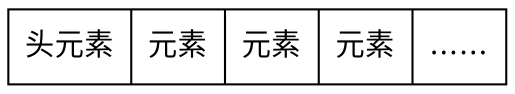

### 1.1.1.顺序表支持的操作

顺序表支持以下操作：

1. 获取元素个数总数。
1. 读取任意位置的元素。
1. 更改任意位置的元素。
1. 向任意位置插入元素。
1. 删除任意位置的元素。

#### 获取元素个数

使用一个整形变量记录元素个数，在表中元素发生改变时及时更新变量值。

#### 读取或更改某位置元素

在顺序表中，元素依次紧密排列在内存中，且各元素所占内存大小相同，因此可以通过元素位置直接计算得到其物理地址。一般情况下，顺序表多为使用数组实现，因此可以直接通过数组下标访问元素或对其进行修改。

>顺序表访问或更改某元素的时间复杂度为$O(1)$。

#### 向某位置插入元素

向某位置插入元素时，需要将此位置及之后的所有元素向后挪动一个内存单位（元素所占用内存大小），然后将待插入元素插入空出的内存位置。

将*待插入元素*插入*元素2*所在位置。

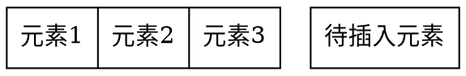

第1步，将顺序表元素个数变量值加1。

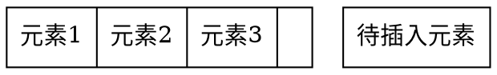

第2步，依次将*元素3*、*元素2*后移覆盖其后序元素：

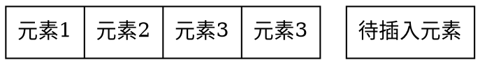

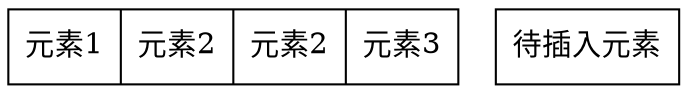

第3步，将待插入元素覆盖原先*元素2*的位置：

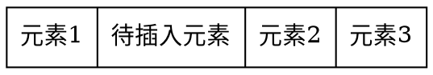

>顺序表插入元素的平均时间复杂度为$O(n)$。

#### 删除某位置元素

删除顺序表中某位置的元素的方法为：依次将该位置后面的的所有元素覆盖其前序元素。

删除*待删除元素*：

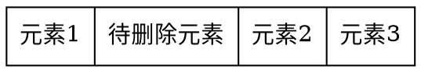

第1步，依次将*元素2*、*元素3*前移覆盖其前序：

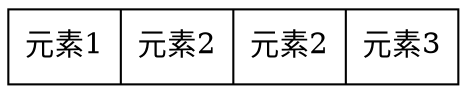

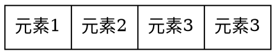

第2步，将顺序表元素个数变量值减1。

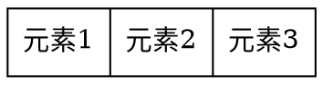

>顺序表删除元素的平均时间复杂度为$O(n)$。

### 1.1.2. STL中的vector类实现

**（是否应该使用vector作为例子来讲解？感觉vector无关细节过多）**

作为最为基本的常用数据结构，通常现代程序设计语言都直接内置了顺序表的实现。以下代码模拟了C++标准容器类库中vector的实现。

```c++{class="line-numbers"}
#ifndef Vector_h
#define Vector_h
#define INIT_CAPACITY 4

template <class T>
class Vector {
private:
    T *m_data;
    int m_size;
    int m_capacity;
    
    void Error(const char* cs)const{std::cerr<<cs<<std::endl;exit(1);};
    
public:
    Vector(int n=INIT_CAPACITY);
    Vector(const Vector& v);
    ~Vector();
    Vector& operator=(const Vector<T>& v);
    T& operator[](int id);
    const T& operator[](int id)const;
    int capacity()const;
    int size()const;
    void push_back(const T& item);
    void pop_back();
    const T& back()const;
    const T& front()const;
    void reserve(int newCapacity);
    
    typedef T* Iterator;
    typedef const T* const_Iterator;
    Iterator begin();
    const_Iterator begin()const;
    Iterator end();
    const_Iterator end()const;
};


template <class T>
Vector<T>::Vector(int n) {
    if(n <= 0) Error("初始容量必须大于0");
    m_size = 0;
    m_capacity = n;
    m_data = new T[m_capacity];
}

template <class T>
Vector<T>::Vector(const Vector<T>& v) {
    m_data = NULL;
    m_capacity = 0;
    operator=(v);
}

template <class T>
Vector<T>::~Vector() {
    delete[] m_data;
}

template<class T>
Vector<T>& Vector<T>::operator=(const Vector<T>& v){
    if (m_capacity < v.m_capacity){
        delete[] m_data;
        m_capacity = v.m_capacity;
        m_data = new T[m_capacity];
    }
    m_size = v.size();
    for(int i=0; i<m_size; ++i) m_data[i] = v.m_data[i];
    return (*this);
}


/*如何考虑下标越界的情况*/
template<class T>
T& Vector<T>::operator[](int id){
    return m_data[id];
}

template<class T>
const T& Vector<T>::operator[](int id)const{
    return m_data[id];
}


template <class T>
int Vector<T>::size()const{
    return m_size;
}

template <class T>
int Vector<T>::capacity()const{
    return m_capacity;
}

template <class T>
void Vector<T>::push_back(const T& item){
    if(m_size == m_capacity) reserve(2*m_capacity + 1);
    m_data[m_size]=item;
    m_size++;
}

template <class T>
void Vector<T>::pop_back(){
    if(m_size == 0)Error("容器已空！");
    m_size--;
}


/***
 为容器扩容, 如何考虑小于容量的情况
*/
template <class T>
void Vector<T>::reserve(int newCapacity) {
    T* old = m_data;
    m_data = new T[newCapacity];
    for (int i=0; i<m_size; ++i) {
        m_data[i] = old[i];
    }
    m_capacity = newCapacity;
    delete [] old;
}

#endif /* Vector_h */
```

## 1.2.链表

### 1.2.1.单链表

```c++{class="line-numbers"}
struct link_node{
    int data;
    link_node* next;
    link_node(int d, link_node* n):data(d), next(n){}
};
```

#### 不带头节点的单链表


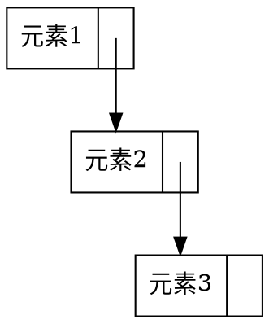

#### 带头节点的单链表

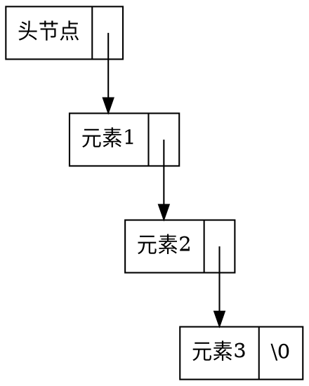

#### 单链表元素遍历

```c++{class="line-numbers"}
//从第一个元素开始，依次打印链表中所有元素
void print_list(link_node* const head){
    auto curr_node = head->next;
    while(curr_node != nullptr){
        cout<<curr_node->data<<" ";
        curr_node = curr_node->next;
    }
}
```

#### 单链表添加元素

```c++{class="line-numbers"}
//在node后插入数据元素data，并返回新元素节点的指针
link_node* insert_after(link_node* const node, int data){
    auto new_node = new link_node(data, nullptr);
    new_node->next = node->next;
    node->next = new_node;
    return new_node;
}
```

在*元素1*之后添加元素

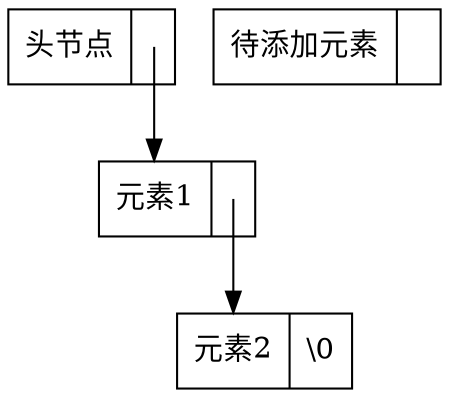

第1步，将待*添加元素*的next指针指向*元素2*。

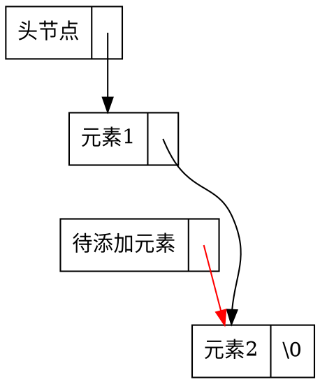

第2步，将*元素1*的next指针指向待*添加元素*。

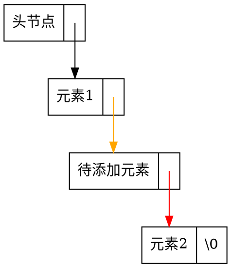

>注意：第1步和第2步的顺序是不能调换的
>单链表添加元素的时间复杂度为$O(1)$。

#### 单链表删除元素

```c++{class="line-numbers"}
//删除node节点后的元素
void delete_after(link_node* const node){
    if(node->next != nullptr){
        auto deleted_node = node->next;
        node->next = node->next->next;
        delete deleted_node;
    }
}
```

>注意：由于单链表的性质，不能删除给定指针的节点。

删除*元素1*后的元素

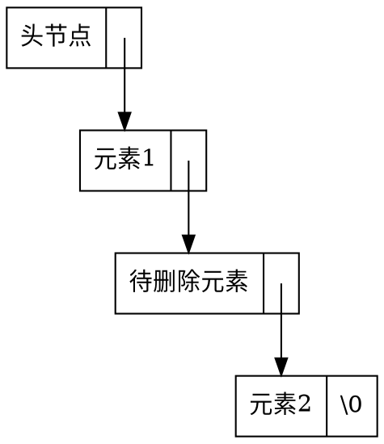

第1步，将待删除元素的前序元素（*元素1*）的next指针指向待删除元素的后续元素（*元素2*）。

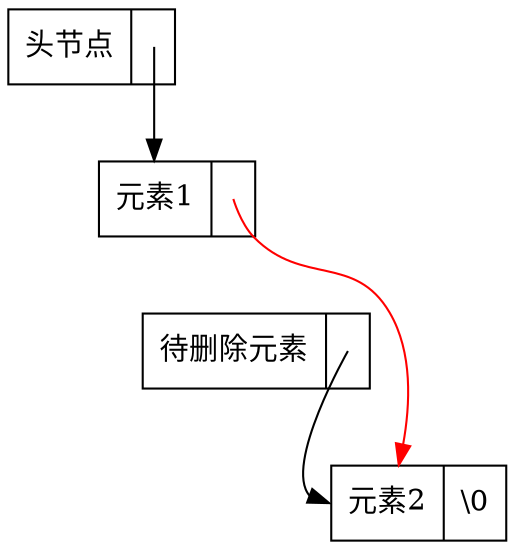

第2步，释放*待删除元素*所占用的内存

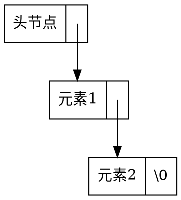

>注意：在删除链表节点时，一定要释放节点内存，以免造成内存泄露。
>单链表删除元素的时间复杂度为$O(1)$。

### 1.2.2.双链表

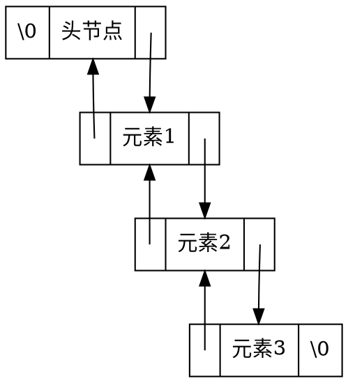

#### 双链表添加元素


在元素1之后添加元素

```dot
digraph G{

    node [shape = record]
    H [label = "<p> \\0|<data> 头节点|<n> "]
    A [label = "<p> |<data> 元素1|<n> "]
    B [label = "<p> |<data> 待添加元素|<n> "]
    C [label = "<p> |<data> 元素2|<n> \\0"]
    A:n:c -> C:data [tailclip=false]
    C:p:c -> A:data [tailclip=false]
    H:n:c -> A:data [tailclip=false]
    A:p:c -> H:data [tailclip=false]
}
```

第1步，将*待添加元素*节点的prev指针指向*元素1*，next指针指向*元素2*。

```dot
digraph G{
    node [shape = record]
    H [label = "<p> \\0|<data> 头节点|<n> " group="list"]
    A [label = "<p> |<data> 元素1|<n> " group="list"]
    B [label = "<p> |<data> 待添加元素|<n> "]
    C [label = "<p> |<data> 元素2|<n> \\0"]
    A:n:c -> C:data:c [tailclip=false ]
    C:p:c -> A:data:c [tailclip=false]
    H:n:c -> A:data [tailclip=false]
    A:p:c -> H:data [tailclip=false]
    B:p:c -> A:data [color=red tailclip=false]
    B:n:c -> C:data [color=red tailclip=false]
    A->B [style=invis]
}
```

第2步，将*元素1*的next指针指向*待添加元素*。将*元素2*的prev指针指向*待添加元素*。

```dot
digraph G{
    node [shape = record]
    H [label = "<p> \\0|<data> 头节点|<n> "]
    A [label = "<p> |<data> 元素1|<n> "]
    B [label = "<p> |<data> 待添加元素|<n> "]
    C [label = "<p> |<data> 元素2|<n> \\0"]
    A:n:c -> B:data [color=orange tailclip=false]
    C:p:c -> B:data [color=orange tailclip=false]
    H:n:c -> A:data [tailclip=false]
    A:p:c -> H:data [tailclip=false]
    B:p:c -> A:data [color=red tailclip=false]
    B:n:c -> C:data [color=red tailclip=false]
}
```

#### 双链表删除元素

```dot
digraph G{
    node [shape = record]
    H [label = "<p> \\0|<data> 头节点|<n> "]
    A [label = "<p> |<data> 元素1|<n> "]
    B [label = "<p> |<data> 待删除元素|<n> "]
    C [label = "<p> |<data> 元素2|<n> \\0"]
    A:n:c -> B:data [tailclip=false]
    C:p:c -> B:data [tailclip=false]
    H:n:c -> A:data [tailclip=false]
    A:p:c -> H:data [tailclip=false]
    B:p:c -> A:data [tailclip=false]
    B:n:c -> C:data [tailclip=false]
}
```

第1步，将*元素1*的next指针指向*元素2*。

```dot
digraph G{
    node [shape = record ]
    H [label = "<p> \\0|<data> 头节点|<n> " ]
    A [label = "<p> |<data> 元素1|<n> "]
    B [label = "<p> |<data> 待删除元素|<n> " group="list"]
    C [label = "<p> |<data> 元素2|<n> \\0" group="list"]
    A:n->B:data[style=invis weight=100 minlen=1]
    A:n:c -> C:data:c [color=red minlen=2 tailclip=false]
    H:n:c -> A:data [tailclip=false]
    A:p:c -> H:data [tailclip=false]
    B:p:c -> A:data [tailclip=false]
    B:n:c -> C:data [tailclip=false ]
    C:p:c -> B:data:c [tailclip=false constraint=false]
}
```

第2步，将*元素2*的prev指针指向*元素1*。

```dot
digraph G{
    node [shape = record]
    H [label = "<p> \\0|<data> 头节点|<n> "]
    A [label = "<p> |<data> 元素1|<n> "]
    B [label = "<p> |<data> 待删除元素|<n> "]
    C [label = "<p> |<data> 元素2|<n> \\0"]
    A:n->B:data[style=invis weight=100 minlen=1]
    A:n:c -> C:data:c [color=red minlen=2 tailclip=false]
    C:p:c -> A:data:c [color=orange]
    H:n:c -> A:data [tailclip=false]
    A:p:c -> H:data [tailclip=false]
    B:p:c -> A:data [tailclip=false]
    B:n:c -> C:data [tailclip=false]
}
```

第3步，释放待删除元素节点所占用的内存。

```dot
digraph G{
    node [shape = record]
    H [label = "<p> \\0|<data> 头节点|<n> "]
    A [label = "<p> |<data> 元素1|<n> "]

    C [label = "<p> |<data> 元素2|<n> \\0"]
    A:n -> C:data [color=red]
    C:p -> A:data [color=orange]
    H:n -> A:data 
    A:p -> H:data 
}
```

### 1.2.4.STL中的list类实现

### 1.2.5.顺序表vs链表

操作 | 顺序表 | 链表
---|---|---
访问第$k$个元素| $O(1)$ | $O(n)$
在表尾插入元素 | $O(1)$ | $O(1)$
在表头插入元素 | $O(n)$ | $O(1)$
删除表尾元素 | $O(1)$ | $O(1)$
删除表头元素 | $O(n)$ | $O(1)$
在任意位置插入元素 | $O(n)$ | $O(1)$（已知节点指针）
删除任意位置的元素 | $O(n)$ | $O(1)$（已知节点指针）

>由于顺序表的元素处于连续内存中，更容易被系统的缓存加速。
除开有大量在表中段插入或删除元素的场景，大部分情况应该选用顺序表作为基础数据结构。

## 1.3.队列

## 1.4.栈

