# 1.线性结构

[TOC]

线性结构是最为简单也是最常用的一类数据逻辑结构。线性结构数据集中除了头元素和尾元素，其他所有元素都有且只有一个前序元素和一个后续元素，头元素没有前序元素，尾元素没有后续元素。

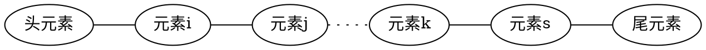

## 1.1.顺序表

顺序表是使用一片连续内存空间存储的线性数据结构。数据集中的元素按照逻辑关系依次紧密地排列在内存空间中。

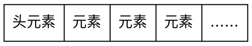

### 1.1.1.顺序表支持的操作

顺序表支持以下操作：

1. 获取元素个数总数。
1. 读取任意位置的元素。
1. 更改任意位置的元素。
1. 向任意位置插入元素。
1. 删除任意位置的元素。

#### 获取元素个数

使用一个整形变量记录元素个数，在表中元素发生改变时及时更新变量值。

#### 读取或更改某位置元素

在顺序表中，元素依次紧密排列在内存中，且各元素所占内存大小相同，因此可以通过元素位置直接计算得到其物理地址。一般情况下，顺序表多为使用数组实现，因此可以直接通过数组下标访问元素或对其进行修改。

>顺序表访问或更改某元素的时间复杂度为$O(1)$。

#### 向某位置插入元素

向某位置插入元素时，需要将此位置及之后的所有元素向后挪动一个内存单位（元素所占用内存大小），然后将待插入元素插入空出的内存位置。

将*待插入元素*插入*元素2*所在位置。

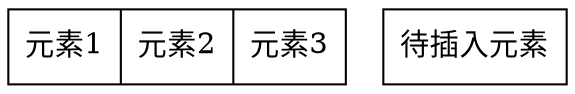

第1步，将顺序表元素个数变量值加1。

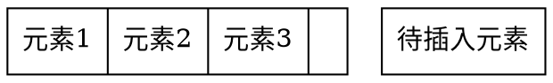

第2步，依次将*元素3*、*元素2*后移覆盖其后序元素：

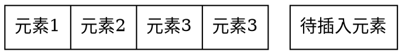

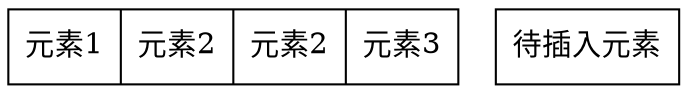

第3步，将待插入元素覆盖原先*元素2*的位置：

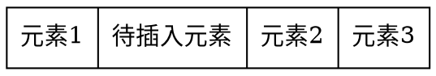

>顺序表插入元素的平均时间复杂度为$O(n)$。

#### 删除某位置元素

删除顺序表中某位置的元素的方法为：依次将该位置后面的的所有元素覆盖其前序元素。

删除*待删除元素*：

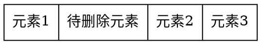

第1步，依次将*元素2*、*元素3*前移覆盖其前序：

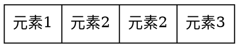

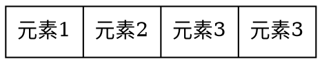

第2步，将顺序表元素个数变量值减1。

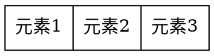

>顺序表删除元素的平均时间复杂度为$O(n)$。

### 1.1.2. STL中的vector类实现

作为最为基本的常用数据结构，通常现代程序设计语言都直接内置了顺序表的实现。以下代码模拟了C++标准容器类库中vector的实现。

>**注意：** 由于考虑通用性及效率的考虑，STL中vector的实现方式比此例复杂很多。为了不过多引入语言细节干扰，我们在此仅展示vector的基础思想。

```c++{class="line-numbers"}
#ifndef simVector_h
#define simVector_h
#define INIT_CAPACITY 4

template <class T>
class simVector{
private:
    T *m_data;
    int m_size;
    int m_capacity;
public:
    simVector(int n=INIT_CAPACITY);
    ~simVector();
    T& operator[](int id);
    int capacity()const;
    int size()const;
    void reserve(int newCapacity);
    
    void push_back(const T item);
    void insert_elem(int index, T data);
    void delete_elem(int index);
};

template <class T>
simVector<T>::simVector(int n) {
    m_size = 0;
    m_capacity = n;
    m_data = new T[m_capacity];
}

template <class T>
simVector<T>::~simVector() {
    delete[] m_data;
}

template<class T>
T& simVector<T>::operator[](int id){
    return m_data[id];
}

template <class T>
int simVector<T>::size()const{
    return m_size;
}

template <class T>
int simVector<T>::capacity()const{
    return m_capacity;
}

template <class T>
void simVector<T>::reserve(int newCapacity) {
    T* old = m_data;
    m_data = new T[newCapacity];
    for (int i=0; i<m_size; ++i) {
        m_data[i] = old[i];
    }
    m_capacity = newCapacity;
    delete [] old;
}

template <class T>
void simVector<T>::push_back(const T data){
    if(m_size == m_capacity) reserve(2*m_capacity + 1);
    m_data[m_size]=data;
    m_size++;
}

template <class T>
void simVector<T>::insert_elem(int index, T data) {
    if(m_size == m_capacity){
        reserve(m_capacity*2);
    }
    m_size++;
    for(int i=m_size-1; i> index; i--){
        m_data[i] = m_data[i-1];
    }
    m_data[index] = data;
}

template <class T>
void simVector<T>::delete_elem(int index){
    for(int i=index; i<m_size-1; ++i){
        m_data[i] = m_data[i+1];
    }
    m_size--;
}

#endif /* simVector_h */
```


以下代码示例了simVector的使用方法。

```c++{class="line-numbers"}
#include <iostream>
#include "simVector.h"
using namespace std;

int main() {
    simVector<int> vec;
    for(int i=0;i<10; ++i){
        vec.push_back(i);
    }
    vec.insert_elem(5, -1);
    vec.delete_elem(7);
    for(int i=0;i<vec.size(); ++i){
        cout<<vec[i]<<" ";
    }
    cout<<endl<<vec.size();
}
```

代码的输出为

>0 1 2 3 4 -1 5 7 8 9
10

关于STL的vector使用方法，参见：
https://cplusplus.com/reference/vector/vector/

## 1.2.链表

链表是一类线性数据结构，与顺序表不同，链表的元素可能并不存在于一片连续的内存空间。逻辑相邻的元素可能物理上并不相邻，同时物理上相邻的元素可能逻辑并不相邻。

链表结构使用链表节点存储数据元素。通常一个节点存储一个数据元素，并使用节点指针维护元素之前的前后关系。在实践中，使用一个指向某节点的节点指针对链表进行操作。

### 1.2.1.链表支持的操作

链表支持以下操作：

1. 获得第一个元素节点的指针。
1. 获得某元素节点的前序或者后续节点的指针。
1. 更改当前指针所指向节点的元素。
1. 在指针所在位置插入元素。
1. 在指针所在位置删除元素（注意，单链表只能删除所在指针的后续元素）。

### 1.2.2.单链表

单链表的节点结构如下，存储一个数据元素（int data），和一个指向此类结构体的指针（link_node* next）。

```c++{class="line-numbers"}
struct link_node{
    int data;
    link_node* next;
    link_node(int d, link_node* n):data(d), next(n){}
};
```

根据是否有头节点，单链表有两种形式

#### 不带头节点的单链表

不带头节点的单链表的每一个节点都存储一个数据元素，next指针指向该元素后续元素的结构体，最后一个节点的next指针为空。

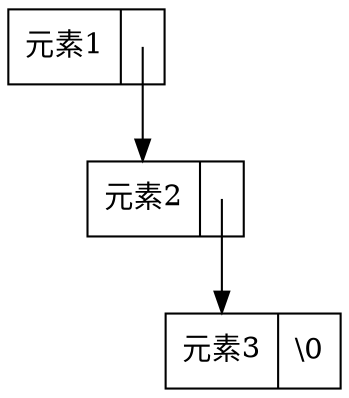

#### 带头节点的单链表

除头结点外，带头节点的单链表的每一个节点都存储一个数据元素，next指针指向该元素后续元素的结构体，最后一个节点的next指针为空。头节点的数据域data不存储任何有意义的信息。

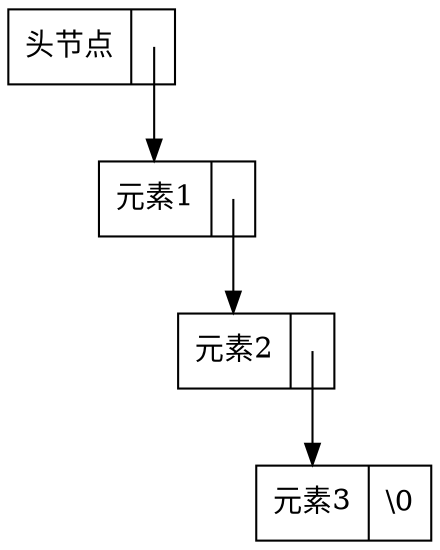

在实践中，带头节点的单链表使用得更多一些。因为，如果没有头节点，那么对链表第一个元素进行操作的代码将与其他元素不同，造成编码相对困难。而带头节点的链表可以使用同一套代码操作所有元素。以下代码都以带头节点的链表为例。

#### 单链表元素遍历

```c++{class="line-numbers"}
//从第一个元素开始，依次打印链表中所有元素
void print_list(link_node* const head){
    auto curr_node = head->next;
    while(curr_node != nullptr){
        cout<<curr_node->data<<" ";
        curr_node = curr_node->next;
    }
}
```

>由于链表的元素可能散落在内存的各个位置，需要使用指针从头节点开始根据next指针依次定位各个元素。不能像顺序表那样直接得到第$k$个元素的地址。

#### 单链表添加元素

```c++{class="line-numbers"}
//在node后插入数据元素data，并返回新元素节点的指针
link_node* insert_after(link_node* const node, int data){
    auto new_node = new link_node(data, nullptr);
    new_node->next = node->next;
    node->next = new_node;
    return new_node;
}
```

在*元素1*之后添加元素

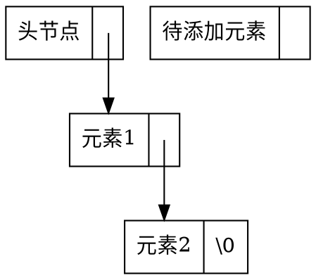

第1步，将待*添加元素*的next指针指向*元素2*。

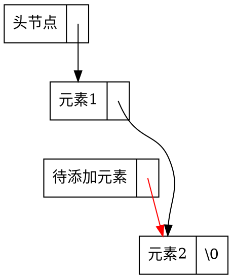

第2步，将*元素1*的next指针指向待*添加元素*。

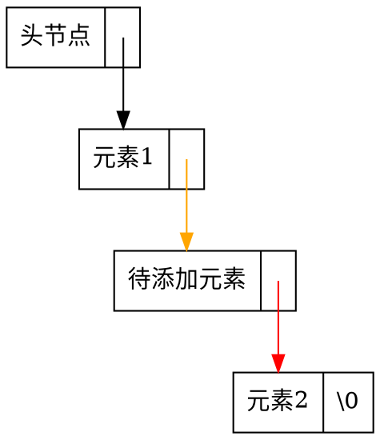

>**注意：** 第1步和第2步的顺序是不能调换的
>单链表添加元素的时间复杂度为$O(1)$。

#### 单链表删除元素

```c++{class="line-numbers"}
//删除node节点后的元素
void delete_after(link_node* const node){
    if(node->next != nullptr){
        auto deleted_node = node->next;
        node->next = node->next->next;
        delete deleted_node;
    }
}
```

>注意：由于单链表的性质，不能删除给定指针的节点。（思考：为什么？）

删除*元素1*后的元素

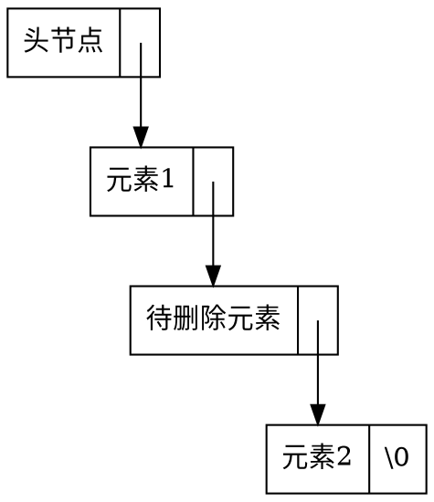

第1步，将待删除元素的前序元素（*元素1*）的next指针指向待删除元素的后续元素（*元素2*）。

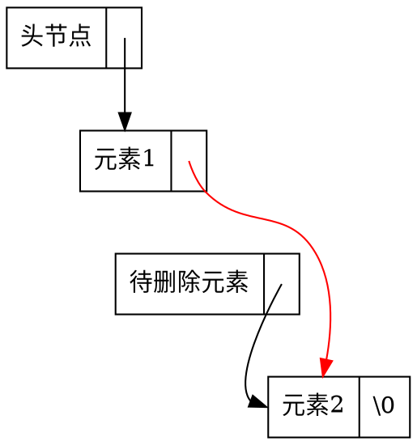

第2步，释放*待删除元素*所占用的内存

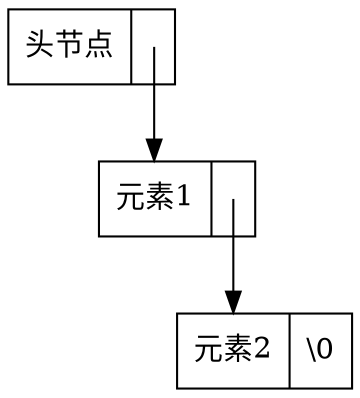

>**注意：** 在删除链表节点时，一定要释放节点内存，以免造成内存泄露。
>单链表删除元素的时间复杂度为$O(1)$。

### 1.2.3.双链表

单链表在操作时，只能从头节点方向开始依次向后进行。而实践中，有时会希望反向或双向进行。在这种需求下，可以使用双链表。

与单链表相同，

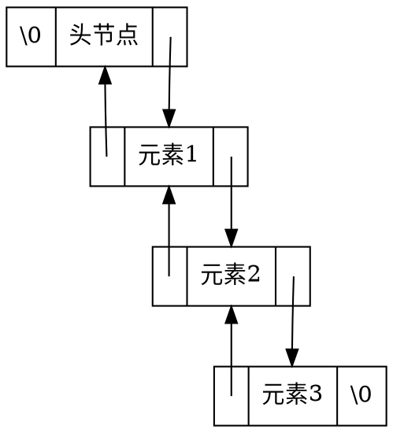

以下代码依次从头到尾和从尾到头打印双链表中的元素。如果带头节点的双链表中的元素为{4，3，2，1}， 那么下面的代码将打印出
>4 3 2 1 1 2 3 4

```c++{class="line-numbers"}
void check_double_list(double_link_node* const head){
    auto curr_node = head->next;
    if(curr_node == nullptr){
        return;
    }
    while(curr_node->next != nullptr){
        cout<<curr_node->data<<" ";
        curr_node = curr_node->next;
    }
    cout<<curr_node->data<<" ";
    while(curr_node != head){
        cout<<curr_node->data<<" ";
        curr_node = curr_node->prev;
    }
}
```

#### 双链表添加元素

```c++{class="line-numbers"}
//在node节点之后，添加元素data
double_link_node* insert_after(double_link_node* const node, int const data){
    auto new_node = new double_link_node(data, nullptr, nullptr);
    new_node->next = node->next;
    new_node->prev = node;
    node->next = new_node;
    if(new_node->next != nullptr){
        new_node->next->prev = new_node;
    }
    return new_node;
}
```

举例：

在元素1之后添加元素

```dot
digraph G{

    node [shape = record]
    H [label = "<p> \\0|<data> 头节点|<n> "]
    A [label = "<p> |<data> 元素1|<n> "]
    B [label = "<p> |<data> 待添加元素|<n> "]
    C [label = "<p> |<data> 元素2|<n> \\0"]
    A:n:c -> C:data [tailclip=false]
    C:p:c -> A:data [tailclip=false]
    H:n:c -> A:data [tailclip=false]
    A:p:c -> H:data [tailclip=false]
}
```

第1步，将*待添加元素*节点的prev指针指向*元素1*，next指针指向*元素2*。

```dot
digraph G{
    node [shape = record]
    H [label = "<p> \\0|<data> 头节点|<n> " group="list"]
    A [label = "<p> |<data> 元素1|<n> " group="list"]
    B [label = "<p> |<data> 待添加元素|<n> "]
    C [label = "<p> |<data> 元素2|<n> \\0"]
    A:n:c -> C:data:c [tailclip=false ]
    C:p:c -> A:data:c [tailclip=false]
    H:n:c -> A:data [tailclip=false]
    A:p:c -> H:data [tailclip=false]
    B:p:c -> A:data [color=red tailclip=false]
    B:n:c -> C:data [color=red tailclip=false]
    A->B [style=invis]
}
```

第2步，将*元素1*的next指针指向*待添加元素*。将*元素2*的prev指针指向*待添加元素*。

```dot
digraph G{
    node [shape = record]
    H [label = "<p> \\0|<data> 头节点|<n> "]
    A [label = "<p> |<data> 元素1|<n> "]
    B [label = "<p> |<data> 待添加元素|<n> "]
    C [label = "<p> |<data> 元素2|<n> \\0"]
    A:n:c -> B:data [color=orange tailclip=false]
    C:p:c -> B:data [color=orange tailclip=false]
    H:n:c -> A:data [tailclip=false]
    A:p:c -> H:data [tailclip=false]
    B:p:c -> A:data [color=red tailclip=false]
    B:n:c -> C:data [color=red tailclip=false]
}
```

> 双链表添加元素的时间复杂度为$O(1)$。

#### 双链表删除元素

```c++{class="line-numbers"}
//删除节点node
void delete_node(double_link_node* const node){
    auto prev = node->prev;
    auto next = node->next;
    
    prev->next = node->next;
    next->prev = node->prev;
    
    delete node;
}
```

删除*待删除元素*：

```dot
digraph G{
    node [shape = record]
    H [label = "<p> \\0|<data> 头节点|<n> "]
    A [label = "<p> |<data> 元素1|<n> "]
    B [label = "<p> |<data> 待删除元素|<n> "]
    C [label = "<p> |<data> 元素2|<n> \\0"]
    A:n:c -> B:data [tailclip=false]
    C:p:c -> B:data [tailclip=false]
    H:n:c -> A:data [tailclip=false]
    A:p:c -> H:data [tailclip=false]
    B:p:c -> A:data [tailclip=false]
    B:n:c -> C:data [tailclip=false]
}
```

第1步，将*元素1*的next指针指向*元素2*。

```dot
digraph G{
    node [shape = record ]
    H [label = "<p> \\0|<data> 头节点|<n> " ]
    A [label = "<p> |<data> 元素1|<n> "]
    B [label = "<p> |<data> 待删除元素|<n> " group="list"]
    C [label = "<p> |<data> 元素2|<n> \\0" group="list"]
    A:n->B:data[style=invis weight=100 minlen=1]
    A:n:c -> C:data:c [color=red minlen=2 tailclip=false]
    H:n:c -> A:data [tailclip=false]
    A:p:c -> H:data [tailclip=false]
    B:p:c -> A:data [tailclip=false]
    B:n:c -> C:data [tailclip=false ]
    C:p:c -> B:data:c [tailclip=false constraint=false]
}
```

第2步，将*元素2*的prev指针指向*元素1*。

```dot
digraph G{
    node [shape = record]
    H [label = "<p> \\0|<data> 头节点|<n> "]
    A [label = "<p> |<data> 元素1|<n> "]
    B [label = "<p> |<data> 待删除元素|<n> "]
    C [label = "<p> |<data> 元素2|<n> \\0"]
    A:n->B:data[style=invis weight=100 minlen=1]
    A:n:c -> C:data:c [color=red minlen=2 tailclip=false]
    C:p:c -> A:data:c [color=orange tailclip=false]
    H:n:c -> A:data [tailclip=false]
    A:p:c -> H:data [tailclip=false]
    B:p:c -> A:data [tailclip=false]
    B:n:c -> C:data [tailclip=false]
}
```

第3步，释放待删除元素节点所占用的内存。

```dot
digraph G{
    node [shape = record]
    H [label = "<p> \\0|<data> 头节点|<n> "]
    A [label = "<p> |<data> 元素1|<n> "]

    C [label = "<p> |<data> 元素2|<n> \\0"]
    A:n:c -> C:data [color=red tailclip=false]
    C:p:c -> A:data [color=orange tailclip=false]
    H:n:c -> A:data [tailclip=false]
    A:p:c -> H:data [tailclip=false]
}
```

>**注意：** 与单链表相同，双链表在删除元素时要记得释放删除节点的内存空间，以免内存泄露。删除双链表中元素的时间复杂度为$O(1)$。

以下代码的输出为：

> 4 2 1 1 2 4

```c++{class="line-numbers"}
int main() {
    auto list_head = new double_link_node(0, nullptr, nullptr);
    insert_after(list_head, 1);
    insert_after(list_head, 2);
    auto n = insert_after(list_head, 3);
    insert_after(list_head, 4);
    delete_node(n);
    check_double_list(list_head);
}
```

### 1.2.4.STL中的list类实现

在STL中同样有一个内置的双链表容器结构list。以下代码模拟了list类的实现。

>**注意：** 由于考虑通用性及效率的考虑，STL中list的实现方式比此例复杂很多。为了不过多引入语言细节干扰，我们在此仅展示list的基础思想。

```c++{class="line-numbers"}
#ifndef simList_h
#define simList_h

template <class T>
class simList {
private:
    struct Node{
        T data;
        Node *prev, *next;
        Node(const T &d, Node *p, Node *n):data(d), prev(p), next(n){};
    };
    int m_size;
    Node *m_head;
    Node *m_tail;
public:
    class Iterator{
        friend class simList<T>;
    private:
        Node *current;
        
        Iterator(Node *p):current(p){};
    public:
        T& get_data();
        Iterator next();
        Iterator prev();
        
        bool operator!=(Iterator itr);
    };
    
    simList();
    ~simList();
    Iterator begin();
    Iterator end();
    Iterator insert(Iterator itr, T item);
    Iterator erase(Iterator itr);
    int size(){return m_size;}
    
    void push_back(const T item); //在List尾部添加数据元素item
};


template <class T>
simList<T>::simList() {
    m_size = 0;
    m_head = new Node(T(), NULL, NULL);
    m_tail = new Node(T(), NULL, NULL);
    m_head->next = m_tail;
    m_tail->prev = m_head;
}

template <class T>
simList<T>::~simList(){
    while(m_size > 0){
        erase(begin());
    }
    delete m_head;
    delete m_tail;
}

/***
 返回头节点迭代器
*/
template <class T>
typename simList<T>::Iterator simList<T>::begin() {
    return simList<T>::Iterator(m_head->next);
}

/***
 返回尾节点迭代器
 */
template <class T>
typename simList<T>::Iterator simList<T>::end() {
    return simList<T>::Iterator(m_tail);
}

/***
 在迭代器itr位置之前插入item
*/
template <class T>
typename simList<T>::Iterator simList<T>::insert(Iterator itr, T item) {
    Node *p = itr.current;
    Node *newNode = new Node(item, p->prev, p);
    p->prev->next = newNode;
    p->prev = p->prev->next;
    ++m_size;
    return Iterator(p->prev);
}

/***
 在list末尾插入item
*/
template <class T>
void simList<T>::push_back(const T item){
    insert(end(), item);
}

/***
 获取前序迭代器
*/
template <class T>
typename simList<T>::Iterator simList<T>::Iterator::prev() {
    return simList<T>::Iterator(current->prev);
}

/***
 获取后继迭代器
*/
template <class T>
typename simList<T>::Iterator simList<T>::Iterator::next() {
    return simList<T>::Iterator(current->next);
}

/***
 迭代器的不等判断
*/
template <class T>
bool simList<T>::Iterator::operator!=(Iterator itr) {
    return current != itr.current;
}

/***
 获取迭代器当前指向元素
*/
template <class T>
T& simList<T>::Iterator::get_data() {
    return current->data;
}

/***
 删除迭代器指向的节点
*/
template <class T>
typename simList<T>::Iterator simList<T>::erase(simList<T>::Iterator itr) {
    Node *p = itr.current;
    Iterator re(p->next);
    p->prev->next = p->next;
    p->next->prev = p->prev;
    delete p;
    m_size--;
    return re;
}
#endif /* simList_h */
```

与vector不同，list只能通过迭代器不能通过下标访问数据元素。以下代码展示了如何使用simList。

```c++{class="line-numbers"}
#include <iostream>
#include "simList.h"

using namespace std;

int main() {
    simList<int> list;
    
    list.push_back(1);
    list.push_back(2);
    list.push_back(3);
    list.push_back(4);
    
    for(auto iterator = list.begin(); iterator != list.end(); iterator=iterator.next()){
        if(iterator.get_data() == 2){
            list.insert(iterator, 0);
            list.erase(iterator);
            break;
        }
    }
    
    for(auto iterator = list.begin(); iterator != list.end();iterator=iterator.next()){
        cout<<iterator.get_data()<<" ";
    }
}
```

上述代码的过程为：
首先依次向list尾部插入数据{1,2,3,4}。随后在list中寻找等于2的元素，在其前面插入0，并删除该元素。代码的输出为：

> 1 0 3 4

关于STL中的list使用方法，参见：
https://cplusplus.com/reference/list/list/

### 1.2.5.顺序表vs链表

操作 | 顺序表 | 链表
---|---|---
访问第$k$个元素| $O(1)$ | $O(n)$
在表尾插入元素 | $O(1)$ | $O(1)$
在表头插入元素 | $O(n)$ | $O(1)$
删除表尾元素 | $O(1)$ | $O(1)$
删除表头元素 | $O(n)$ | $O(1)$
在任意位置插入元素 | $O(n)$ | $O(1)$（已知节点指针）
删除任意位置的元素 | $O(n)$ | $O(1)$（已知节点指针）

>**建议：** 由于顺序表的元素处于连续内存中，局部性更好，更容易被系统的缓存加速。
除开有大量在表中段插入或删除元素的场景，大部分情况应该选用顺序表作为基础数据结构。

## 1.3.队列

队列是一种限制元素操作位置的线性结构。队列一般只支持如下操作：

1. 从队列尾插入元素。
1. 访问队列头的元素。
1. 从队列头删除元素。
1. 查询队列中元素的个数。

因此，队列中的元素遵循**先入先出原则**（FIFO: First In First Out）。

```dot
digraph G{

    H[label="队列头" color=white]
    元素1->元素2[ arrowhead=none constraint = false]
    元素2->元素3[ arrowhead=none constraint = false]
    元素3->元素4[ arrowhead=none constraint = false]
    元素4->元素5[ arrowhead=none constraint = false]

    rank=same{
        元素1,元素2,元素3,元素4,元素5
    }
    T[label="队列尾" color=white]

    H -> 元素1
    T -> 元素5

    PUSH[label="插入元素" color=white]
    POP [label="删除元素" color=white]

    rank=same{
        PUSH,POP
    }

    PUSH -> 元素5:e [arrowhead=vee]
    元素1:w -> POP [arrowhead=vee]
}
```

### 1.3.1.队列的实现

由于队列是一种带使用限制的线性结构，顺序表和链表都包含了队列的所有操作，因此可以使用顺序表和链表作为内核从而实现队列结构。

以下代码以链表为内核实现队列：

```c++{class="line-numbers"}
#ifndef simQueue_h
#define simQueue_h

#include "simList.h"

template<class T>
class simQueue{
private:
    simList<T> queueL;
public:
    int size(){return queueL.size();}
    bool isEmpty(){return queueL.size() == 0;}
    T& front(){return queueL.begin().get_data();}
    void push(T item){queueL.insert(queueL.end(), item);}
    void pop(){queueL.erase(queueL.begin());}
};

#endif /* simQueue_h */
```

以下代码为simQueue的使用示例：

```c++{class="line-numbers"}
#include <iostream>
#include "simQueue.h"

using namespace std;

int main() {
    simQueue<int> Q;
    Q.push(1);
    Q.push(2);
    Q.push(3);
    
    while(!Q.isEmpty()){
        cout<<Q.front()<<" ";
        Q.pop();
    }
}
```

执行结果为：

> 1 2 3

STL中同样有已经实现好的队列queue类，使用方法参见：
https://cplusplus.com/reference/queue/queue/

## 1.4.栈

栈是一种限制元素操作位置的线性结构。栈一般只支持如下操作：

1. 从栈顶插入元素。
1. 访问栈顶元素。
1. 从栈顶删除元素。
1. 查询栈顶中元素的个数。

因此，栈顶中的元素遵循**先入后出原则**（FILO: First In Last Out）。

```dot
digraph G{

    元素1->元素2[ arrowhead=none constraint = false]
    元素2->元素3[ arrowhead=none constraint = false]
    元素3->元素4[ arrowhead=none constraint = false]
    元素4->元素5[ arrowhead=none constraint = false]

    rank=same{
        元素1,元素2,元素3,元素4,元素5
    }
    T[label="堆顶" color=white]

    T -> 元素5 [weight=100]

    PUSH[label="插入元素" color=white]
    POP [label="删除元素" color=white]

    rank=same{
        T,POP
    }

    PUSH -> 元素5:ne [arrowhead=vee]
    元素5:se -> POP [arrowhead=vee]
}
```

### 1.4.1.栈的实现

与队列类似，由于栈也是一种带使用限制的线性结构，顺序表和链表都包含了栈的所有操作，因此可以使用顺序表和链表作为内核从而实现栈结构。

以下代码以链表为内核实现栈：

```c++{class="line-numbers"}
#ifndef simStack_h
#define simStack_h

#include "simList.h"

template<class T>
class simStack{
private:
    simList<T> stackL;
public:
    int size(){return stackL.size();}
    bool isEmpty(){return stackL.size()==0;}
    T& top(){return stackL.end().prev().get_data();}
    void push(T item){stackL.insert(stackL.end(), item);}
    void pop(){stackL.erase(stackL.end().prev());}
};

#endif /* simStack_h */
```

以下代码为simStack的使用示例：

```c++{class="line-numbers"}
    simStack<int> S;
    S.push(1);
    S.push(2);
    S.push(3);
    
    while(!S.isEmpty()){
        cout<<S.top()<<" ";
        S.pop();
    }
```

执行结果为：

> 3 2 1

STL中同样有已经实现好的队列queue类，使用方法参见：
https://cplusplus.com/reference/stack/stack/

>**建议：** 由于线性结构在实际工程中使用十分频繁且绝大部分高级程序语言均内置了基础线性结构，在实际工作中应尽可能使用程序语言默认提供的线性结构类以最大化代码运行效率以及最小化出错概率。
C++的标准模板库（STL）提供的线性结构有：
>
>* 顺序表：std::vector
>* 链表：std::list
>* 队列：std::queue
>* 栈：std::stack
