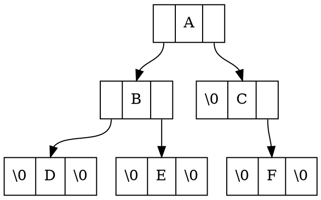

# 2.二叉树

[TOC]

## 2.1.二叉树的基本概念

## 2.2.顺序存储的二叉树

### 2.2.1.顺序存储结构

### 2.2.1.堆

## 2.3.链式存储的二叉树

### 2.3.1.链式存储结构

#### 哈夫曼树

#### 二叉搜索树

#### 平衡二叉搜索树

## 2.4.二叉树的遍历

### 2.4.1.前、中、后序遍历

### 2.4.2.层次遍历

## 2.5.基于二叉树思想的算法

